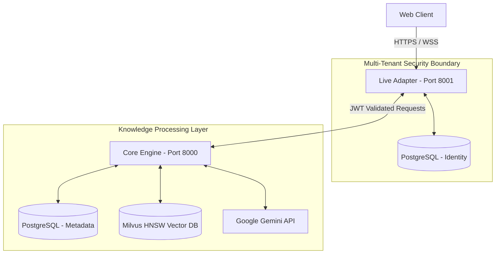

<div align="center">

<p><i>A project report on</i></p>

# CaRAG: Categorical Routing Augmented Generation Platform

<br><br>

<p><i>by</i></p>

### **Anuj Sharma**
**Pandit Deendayal Energy University**

<br><br><br><br><br><br>

### **Internship Details**

**Organization:** Jio Platforms Limited (Jio Cortex AI - Agentic AI Platform)  
**Mentors:** Ms. Manisha Singh (L1 Manager), Mr. Sonu Yadav (Vertical Lead), Mr. Sandeep Bisht (Head)  
**Start date:** 26 May 2026  
**End date:** 15 Jul 2026  

</div>

<div style="page-break-before: always"></div>

<div style="page-break-before: always"></div>

## ABSTRACT

The enterprise adoption of Large Language Models (LLMs) is fundamentally bottlenecked by hallucination risks and data privacy concerns. Standard Retrieval-Augmented Generation (RAG) architectures attempt to solve this using simple dense vector similarity, but often fail at scale due to semantic noise, lack of exact keyword recall, and an inability to strictly isolate multi-tenant data. 

This report documents the architectural design, engineering evolution, and implementation of **CaRAG** (Categorical Routing Augmented Generation). CaRAG is not merely a chatbot wrapper; it is a deterministic, two-layer retrieval platform. By decoupling identity management (Live Adapter) from knowledge processing (Core Engine), the system isolates multi-tenant data effectively. JWT authentication, combined with authorization checks, Postgres group boundaries, and Milvus metadata filters, creates the strict data boundary required for enterprise deployment. 

To minimize hallucination, the retrieval pipeline discards standard Bi-Encoder setups in favor of a hybrid architecture. It unites the near-logarithmic semantic scale of HNSW graphs with the lexical exactness of BM25, fuses the results via Reciprocal Rank Fusion, and subjects them to Stage-2 Cross-Encoder reranking. Finally, a hard Confidence Gate evaluates the self-attention scores, explicitly preventing low-confidence retrievals from reaching the generative layer. The resulting architecture successfully transforms generative AI from an unpredictable black box into a mathematically grounded, secure enterprise asset.

---

## ACKNOWLEDGEMENT

Building a deterministic AI routing engine requires rigorous guidance, rapid feedback loops, and an environment that forgives early mistakes while demanding ultimate precision. 

Profound gratitude goes to Ms. Manisha Singh, my L1 manager and mentor, for her relentless support and sharp engineering insights that fundamentally shaped the direction of CaRAG. Equal thanks are owed to Mr. Sonu Yadav for his invaluable perspective within our vertical, ensuring the project met high-stakes industry standards, and to Mr. Sandeep Bisht for fostering a top-down culture of relentless innovation at Jio Platforms Limited. 

This opportunity to contribute to the Jio Cortex AI platform has been deeply humbling. The systems designed here are just the beginning, and there is a strong intention and hope to continue building alongside this extraordinary engineering team in the future.

---

## TABLE OF CONTENTS

1. **Title Page**
2. **Abstract & Acknowledgement**
3. **List of Figures & Acronyms**
4. **Chapter 1: Introduction**
5. **Chapter 2: Project Scope & Engineering Contributions**
6. **Chapter 3: Retrieval Architecture Fundamentals**
7. **Chapter 4: Project Evolution Journey**
8. **Chapter 5: System Architecture & Data Layer**
9. **Chapter 6: Core Engine Implementation**
10. **Chapter 7: Live Multi-Tenant Adapter**
11. **Chapter 8: Engineering Challenges Encountered**
12. **Chapter 9: Testing & Quantitative Impact**
13. **Chapter 10: Key Learnings & Future Roadmap**
14. **Chapter 11: Conclusion**

---

## LIST OF FIGURES

- **Figure 5.1:** High-Level System Architecture
- **Figure 5.2:** Core Backend Sequence Architecture
- **Figure 5.3:** Live Backend Sequence Architecture

## LIST OF ACRONYMS

- **RAG:** Retrieval-Augmented Generation
- **LLM:** Large Language Model
- **JWT:** JSON Web Token
- **HNSW:** Hierarchical Navigable Small World
- **BM25:** Best Matching 25 (Sparse Lexical Search)
- **RRF:** Reciprocal Rank Fusion
- **API:** Application Programming Interface
- **WS:** WebSocket

---

<div style="page-break-before: always"></div>

## Chapter 1: Introduction

### The Enterprise Knowledge Management Problem
Modern enterprises sit on terabytes of unstructured knowledge-PDFs, manuals, policy documents, and contracts. Discovering exact, actionable intelligence within this mass of data is a critical bottleneck. 

### Why LLMs Fail
Large Language Models represent a leap in human-computer interaction, but they suffer from a fatal flaw in enterprise settings: hallucination. An LLM is a probabilistic engine; it predicts the most likely next word based on its training weights. When asked a highly specific, proprietary question it was never trained on, it does not naturally say "I don't know." Instead, it confidently invents a plausible but factually incorrect answer. 

### Why RAG Exists
Retrieval-Augmented Generation (RAG) was created to anchor these probabilistic models to reality. Before asking the LLM to generate an answer, a RAG system intercepts the query, searches a proprietary database for relevant facts, and forces the LLM to synthesize its answer *strictly* from the retrieved documents. 

### Why Traditional RAG Fails
Despite the promise, standard RAG architectures fail in production. They rely on basic Bi-Encoders, which compress documents into dense vectors. 
1. **Semantic Noise:** If a user searches for a specific ID like "AX-4099-B", the vector space dilutes this into a generic concept of "manufacturing part," returning adjacent but wrong manuals.
2. **Cross-Tenant Leakage:** Standard RAG pipelines lack native security boundaries. If Company A and Company B share a vector database, a poorly filtered query might leak Company A's financials to Company B.

### Why CaRAG Was Built
CaRAG was engineered from first principles to solve these exact failures. The platform was designed not just to search, but to *think before it retrieves*, establishing strict data boundaries, hybrid search layers, and deterministic confidence gates. 

---

<div style="page-break-before: always"></div>

## Chapter 2: Project Scope & Engineering Contributions

To understand the scale of the CaRAG platform, it is necessary to examine the engineering footprint developed during this internship.

### 2.1 Project Scope & Engineering Footprint

- **Backend Services:** 2 (Core Processing Engine + Live Multi-Tenant Adapter)
- **REST APIs Developed:** 15+ 
- **Database Systems:** PostgreSQL (Relational) + Milvus (Vector)
- **Authentication:** Stateless JWT-based (HMAC SHA-256)
- **Document Processing:** Automated PDF ingestion, PyPDF extraction, semantic chunking
- **Retrieval Components:** Category Router, Hybrid Retrieval (HNSW+BM25), Cross-Encoder Reranker, Confidence Gate
- **Real-Time Observability:** WebSockets for asynchronous processing updates
- **Deployment Environment:** Local Dockerized Architecture

### 2.2 Core Engineering Contributions

| Contribution | Description |
| :--- | :--- |
| **Retrieval Architecture** | Designed and implemented a dynamic category-aware retrieval flow. |
| **Multi-Tenant Security** | Engineered a stateless JWT-scoped data isolation boundary. |
| **Vector Search Engine** | Integrated Standalone Milvus with HNSW graph indexing. |
| **Hybrid Retrieval** | Wrote custom Rank-BM25 integration fused with dense search via RRF. |
| **Stage-2 Reranking** | Integrated `ms-marco-MiniLM-L-6-v2` for Cross-Encoder precision scoring. |
| **Hallucination Prevention** | Architected deterministic confidence gating to intercept poor retrievals. |
| **Real-Time Updates** | Implemented WebSocket event broadcasting to track document processing. |
| **API Validation** | Designed exhaustive Postman testing and validation workflows. |

### 2.3 Project Timeline

The platform was architected iteratively over an eight-week sprint.

| Week | Milestone Achieved |
| :--- | :--- |
| **Week 1** | Core API scaffolding and baseline PDF ingestion pipeline. |
| **Week 2** | Milvus Standalone integration and basic dense retrieval logic. |
| **Week 3** | Implementation of Gemini-driven Category Routing to reduce search noise. |
| **Week 4** | Monorepo split; architecture of the Multi-Tenant Live Adapter. |
| **Week 5** | JWT Authentication and WebSocket observability integration. |
| **Week 6** | Research and integration of Stage-2 Cross-Encoder reranking. |
| **Week 7** | Refactoring search logic to support Hybrid Retrieval (BM25 + RRF). |
| **Week 8** | Implementation of Confidence Gating and exhaustive Postman validation. |

### 2.4 Project References & Repository Structure

**Project Access:**
- Source Code Repository: [GitHub - AnujSharma-05/CategoRAG](https://github.com/AnujSharma-05/CategoRAG)
- Daily Work Log: [Internship Execution Log](https://docs.google.com/document/d/1r9-Nzrf7thpb9XO4_VRkR5HWRmw8wjSWQjNLeaTFpik/edit?usp=sharing)

**Codebase Layout:**
```text
CaRAG/
|
+-- core_backend/               # The standalone RAG engine (Port 8000)
|   +-- src/
|   |   +-- main.py             # FastAPI app: /upload, /chat, /reset
|   |   +-- services.py         # Hybrid pipeline, RRF, Cross-Encoder, Confidence Gate
|   |   +-- llm_service.py      # Gemini wrappers: classify, route, synthesize
|   |   +-- milvus_store.py     # Milvus client: HNSW indices + scoped chunk search
|   |   +-- bm25_store.py       # In-memory keyword sparse indexing wrapper
|   |   +-- models.py           # SQLAlchemy ORM: Document, Category, DocumentChunk
|   |   +-- config.py           # Configurable thresholds, HNSW params, logging
|
+-- live/                       # The multi-tenant adapter layer (Port 8001)
|   +-- backend/
|       +-- src/
|           +-- main.py         # FastAPI app: auth, groups, documents, chat, ws
|           +-- chat.py         # Scoped RAG chat executing the full hybrid pipeline
|           +-- ws.py           # WebSocket manager: group-broadcast real-time events
|
+-- demo_core.html              # Interactive testing UI for the Core Engine
+-- demo_live.html              # Interactive testing UI for the Live Layer
+-- FLOWS.md                    # Complete sequence diagrams of the architecture
```

---

<div style="page-break-before: always"></div>

## Chapter 3: Retrieval Architecture Fundamentals

Before dissecting the pipeline, it is critical to understand the theoretical computer science foundations underpinning CaRAG's intellectual core.

### 3.1 Bi-Encoder vs. Cross-Encoder
A **Bi-Encoder** independently embeds a query and a document into vectors. This enables fast vector mathematical search (cosine distance) but loses fine-grained linguistic interactions because the query and document never "see" each other during processing. 
**Cross-Encoders** solve this by jointly processing the input as `[query, chunk]`. This allows token-level transformer self-attention between the query words and document words, resulting in extreme precision at the cost of higher latency.

### 3.2 HNSW Graph Indexing
Standard vector databases use a `FLAT` index, which requires O(N) brute-force scanning-checking the query against every single vector in the database. **HNSW** (Hierarchical Navigable Small World) uses a multi-layered proximity graph that achieves near-logarithmic retrieval performance in practice, scaling efficiently to millions of vectors while maintaining high recall.

### 3.3 Confidence Gating
A probabilistic model (LLM) cannot evaluate its own context reliably. **Confidence Gating** introduces a deterministic control flow mechanism. By evaluating the Cross-Encoder score against a hardcoded threshold, the system mathematically blocks low-quality context from ever reaching the LLM, substantially reducing hallucination risk.

---

<div style="page-break-before: always"></div>

## Chapter 4: Project Evolution Journey

The architecture of CaRAG did not emerge fully formed. It evolved iteratively, driven by the identification and resolution of strict engineering limitations.

### Evolution 1: Naive Dense RAG
- **Why it failed:** The initial iteration used a flat Milvus index mapping all documents into a single dense vector space. As the corpus grew, queries returned semantically adjacent but factually incorrect "noise" from unrelated domains.
- **Observation:** A query about "HR Policies" successfully retrieved HR documents, but also pulled in technical manuals that shared similar vocabulary structures.
- **Alternatives Considered:** Filtering by keyword metadata or relying purely on the LLM to ignore irrelevant chunks.
- **Selected Solution:** Implementing a two-stage routing mechanism to constrain the search space before retrieval occurs.

### Evolution 2: Category Routing
- **Why it failed:** While the routing mechanism worked, hardcoding category logic proved fragile and unscalable for dynamic enterprise environments.
- **Observation:** Documents often defied strict singular categorization, and administrators struggled to maintain static routing rules as new document types were ingested.
- **Alternatives Considered:** Building a complex rules engine or relying entirely on manual tagging.
- **Selected Solution:** Integrating a fast, small-context LLM call during the ingestion phase to auto-categorize documents based on their vector embeddings, drastically reducing search space dilution dynamically.

### Evolution 3: Multi-Tenant Isolation
- **Why it failed:** The monolithic architecture mixed document processing logic with user identity logic, posing a severe cross-tenant data leakage risk.
- **Observation:** In a shared environment, it was possible to retrieve chunks from a different tenant's documents if the semantic similarity was high enough, violating fundamental security requirements.
- **Alternatives Considered:** Application-level filtering of chunks after retrieval, which was rejected due to the risk of pulling unauthorized data into application memory.
- **Selected Solution:** Severing the system into a Core Engine and a Live Adapter. The adapter injects strict `group_doc_ids` boundaries directly into every vector query, isolating data securely at the database level.

### Evolution 4: Hybrid Retrieval
- **Why it failed:** Dense vector search alone completely failed when users searched for highly specific, non-semantic terms like part numbers or internal acronyms (e.g., "JPL-2026").
- **Observation:** Dense embeddings compress exact lexical strings into generalized semantic approximations, making them "too fuzzy" for precise enterprise queries.
- **Alternatives Considered:** Attempting to fine-tune the embedding model on internal vocabulary, which was deemed too computationally expensive and brittle.
- **Selected Solution:** Integrating the Rank-BM25 algorithm to guarantee exact-keyword lexical matching, fused mathematically with the dense search results using Reciprocal Rank Fusion (RRF).

### Evolution 5: Cross-Encoder Reranking
- **Why it failed:** Even with RRF, the top 10 results sometimes contained irrelevant chunks because Bi-Encoders approximate relevance without understanding the exact token-level interaction between the query and the chunk.
- **Observation:** The LLM was occasionally forced to synthesize answers from chunks that were technically similar but contextually useless.
- **Alternatives Considered:** Increasing the top-K retrieval count, which only increased token costs and hallucination risks.
- **Selected Solution:** Introducing a Stage-2 Cross-Encoder. By passing `[query, chunk]` concurrently into the model for transformer self-attention, the system achieved extreme precision, shifting the pipeline from "fuzzy matching" to surgical ranking.

### Evolution 6: Confidence Gate
- **Why it failed:** The standard RAG assumption is that the system must always generate an answer. If given a completely unrelated question, the pipeline retrieved the "least irrelevant" chunks, forcing the LLM to hallucinate.
- **Observation:** LLMs are highly susceptible to confidently synthesizing false information when provided with low-quality context.
- **Alternatives Considered:** Prompt engineering the LLM to say "I don't know," which proved probabilistically unreliable.
- **Selected Solution:** Implementing a deterministic, mathematical Confidence Gate. By evaluating the top Cross-Encoder score against a hard threshold, the pipeline explicitly aborts execution before reaching the LLM, physically eliminating the possibility of context-driven hallucination.

---

<div style="page-break-before: always"></div>

## Chapter 5: System Architecture & Data Layer

### 5.1 Authoritative Sequence Diagrams

The following diagrams represent the absolute source of truth for the data flows within CaRAG.

**Figure 5.1: Core Backend Architecture (Knowledge Engine)**

```mermaid
sequenceDiagram
    autonumber
    actor User
    participant API   as FastAPI (main.py)
    participant PG    as PostgreSQL
    participant BG    as BackgroundTask (services.py)
    participant MV    as Milvus DB
    participant GEM   as Google Gemini

    %% ══════════════════════════════════════════════════════════
    %% FLOW 1 - DOCUMENT INGESTION  (POST /upload)
    %% WHY: Ingest a PDF, auto-categorise it, embed every chunk,
    %%      then keep the category knowledge index fresh.
    %% ══════════════════════════════════════════════════════════

    Note over User,GEM: ── FLOW 1: Document Ingestion (POST /upload) ──

    User->>API: POST /upload (file=*.pdf, category?=optional, bypass_llm?=false)
    API->>API: Validate content-type == application/pdf (→ 400 if not PDF)
    API->>API: Save file to uploads/ (os.makedirs + shutil.copyfileobj)
    API->>PG: INSERT Document (status="uploaded", file_path, file_size)
    API->>PG: GET or INSERT Category(name=provided OR "general", group_id=NULL)
    API->>PG: INSERT document_categories link row
    API->>BG: background_tasks.add_task(process_document_task, doc_id, filename, bypass_llm)
    API-->>User: 200 {id, filename, status="uploaded", categories}

    Note over BG,GEM: ── Async: process_document_task(doc_id, bypass_llm) ──

    BG->>PG: UPDATE Document SET status="processing"
    BG->>BG: _extract_text_from_pdf(file_path)  [pypdf PdfReader]
    
    alt Text extraction fails (empty PDF / scanned image)
        BG->>PG: UPDATE Document SET status="failed"
        Note over BG: Pipeline halts - no chunks to work with
    end

    BG->>BG: _chunk_text(text) [RecursiveCharacterTextSplitter, CHUNK_SIZE, CHUNK_OVERLAP]

    alt No chunks produced
        BG->>PG: UPDATE Document SET status="failed"
        Note over BG: Pipeline halts
    end

    %% ── Auto-Categorization (only if category was blank / "general") ──
    Note over BG,GEM: ── Auto-Categorization (if no explicit category provided) ──

    BG->>BG: _extract_summary_text_from_pdf → first 5 pages + last 2 pages
    BG->>BG: _embed_query(summary_text[:1000])  [SentenceTransformer]
    BG->>MV: search_categories(embedding, top_k=1, group_id=NULL)
    
    alt Vector score >= 0.60  [Cosine similarity threshold]
        BG->>BG: resolved_category = matched category_name
        Note over BG: Fast path - no LLM needed
    else Vector score < 0.60 AND bypass_llm=false
        BG->>GEM: llm_service.classify_ingested_document(text_sample[:4000], existing_categories)
        GEM-->>BG: predicted category name (or new category string)
        BG->>BG: resolved_category = LLM response
    else Vector score < 0.60 AND bypass_llm=true
        BG->>BG: resolved_category = "general"  [LLM skipped - cost saving mode]
    end

    alt Gemini 429 / quota exhausted during classification
        BG->>BG: resolved_category = "general"  [graceful fallback, no crash]
    end

    BG->>PG: GET or INSERT Category(name=resolved_category, group_id=NULL)
    BG->>PG: UPDATE document_categories - remove "general" link if a real category was resolved
    BG->>PG: INSERT document_categories link (doc ↔ resolved_category)

    %% ── Chunk Embedding + Milvus Upsert ──
    Note over BG,MV: ── Embedding & Vector Store Upsert ──

    BG->>BG: _embed_texts(all_chunks)  [SentenceTransformer batch encode]
    BG->>MV: milvus_store.upsert_chunks(doc_id, chunks, embeddings)  → returns milvus_ids[]
    BG->>PG: DELETE DocumentChunk WHERE document_id=doc_id  [clean replace]
    BG->>PG: bulk INSERT DocumentChunk (chunk_index, content, milvus_id)
    BG->>PG: UPDATE Document SET status="ready"

    %% ── Post-Ingestion: Category Summary Update ──
    Note over BG,GEM: ── Post-Ingestion: update_categorical_summary(category, group_id=NULL, bypass_llm) ──

    BG->>BG: Skip if category == "general"  [summaries only for real categories]
    BG->>PG: Query all Document WHERE category=name AND status="ready"
    
    alt bypass_llm=false
        BG->>BG: _extract_summary_text_from_pdf for each doc (first 5 + last 2 pages)
        BG->>GEM: model.generate_content(summary_prompt, category_context)
        GEM-->>BG: 2-3 sentence unified summary text
    else bypass_llm=true
        BG->>BG: summary_text = heuristic string: "category covers: {filenames}"
    end

    alt Gemini 429 during summary generation
        BG->>BG: Fallback to heuristic summary - no crash
    end

    BG->>BG: _embed_query(summary_text)
    BG->>PG: UPDATE Category SET summary=summary_text  [stored for GET /categories-with-docs]
    BG->>MV: milvus_store.upsert_category_summary(category_name, summary, embedding, group_id=NULL)

    %% ── Post-Ingestion: Taxonomy Consolidation ──
    Note over BG,GEM: ── Post-Ingestion: consolidate_categories(group_id=NULL, bypass_llm) ──

    alt bypass_llm=true OR fewer than 2 categories exist
        Note over BG: consolidation skipped
    else bypass_llm=false AND 2+ categories exist
        BG->>PG: Query all Category WHERE group_id=NULL → flat list with summaries
        BG->>GEM: Taxonomy prompt → identify parent/child category relationships
        GEM-->>BG: JSON array [{parent_category, sub_category_ids[]}]
        
        alt Gemini returns [] (no groupings possible) or 429
            Note over BG: Consolidation no-ops safely
        end

        loop For each consolidation entry
            BG->>PG: GET or INSERT parent Category (e.g. "Harry Potter Series")
            BG->>PG: Append parent category to all sub-category documents
            BG->>BG: await update_categorical_summary(parent_name, group_id=NULL)
        end
    end

    %% ══════════════════════════════════════════════════════════
    %% FLOW 2 - RAG QUERY  (POST /chat)
    %% WHY: Route a user question through the right knowledge
    %%      scope, retrieve top-k chunks, synthesize an answer.
    %% ══════════════════════════════════════════════════════════

    Note over User,GEM: ── FLOW 2: RAG Chat Query (POST /chat) ──

    User->>API: POST /chat {question, document_id?, category?, top_k, bypass_llm?}
    API->>PG: COUNT Document WHERE status="ready"

    alt No ready documents at all
        API->>PG: COUNT Document WHERE status IN (uploaded, processing)
        alt Processing docs exist
            API-->>User: "Documents are still processing - please wait"
        else No docs at all
            API-->>User: "No documents in system - upload PDFs first"
        end
    end

    API->>API: _embed_query(question)  [SentenceTransformer]

    %% ── Mode A: Explicit Document Pin ──
    alt document_id is provided  [Mode A - Pin to single document]
        API->>PG: GET Document WHERE id=document_id AND status="ready"
        alt Document not found or not ready
            API-->>User: 404 / "Document not ready"
        end
        API->>MV: milvus_hits = milvus_store.search(query_embedding, top_k*3, document_id=doc_id)
        API->>BM25: bm25_hits = bm25_store.search(question, top_k*3, document_id=doc_id)
        API->>API: hits = reciprocal_rank_fusion(milvus_hits, bm25_hits)
        Note over API: Bypasses all category routing - single doc scope

    %% ── Mode B: Explicit Category Filter ──
    else category is provided  [Mode B - Manual category filter]
        API->>PG: Query Document.id JOIN categories WHERE Category.name=category AND status="ready"
        alt No ready docs in that category
            API-->>User: Empty hits → "No info in that category"
        end
        API->>MV: milvus_hits = milvus_store.search(query_embedding, top_k*3, document_ids=doc_ids)
        API->>BM25: bm25_hits = bm25_store.search(question, top_k*3, document_ids=doc_ids)
        API->>API: hits = reciprocal_rank_fusion(milvus_hits, bm25_hits)
        Note over API: Scoped to all docs in chosen category

    %% ── Mode C: Auto 2-Stage Categorical Routing (default) ──
    else No override provided  [Mode C - Automatic categorical routing]
        API->>MV: milvus_store.search_categories(query_vector, top_k=5)
        
        alt Category score < 0.35 OR no category summaries exist  [Confidence Fallback]
            Note over API: Low confidence - skipping category routing
            API->>MV: milvus_hits = milvus_store.search(query_embedding, top_k*3)
            API->>BM25: bm25_hits = bm25_store.search(question, top_k*3)
            API->>API: hits = reciprocal_rank_fusion(milvus_hits, bm25_hits)
        else Category score >= 0.35  [2-Stage Routing Activated]

            alt bypass_llm=false
                API->>GEM: llm_service.classify_query_category(question, category_candidates)
                GEM-->>API: chosen_category name  [LLM Call 1 - cheap routing]
                
                alt LLM returns category not in candidate list  [Hallucination Guard]
                    API->>API: chosen_category = candidates[0]["category_name"]  [top vector match]
                end
            else bypass_llm=true
                API->>API: chosen_category = category_matches[0]["category_name"]  [top vector match]
            end

            alt Gemini 429 during routing
                API->>API: chosen_category = category_matches[0]["category_name"]  [fallback]
            end

            API->>PG: Query Document.id WHERE Category.name=chosen_category AND status="ready"

            alt No ready docs in chosen category
                API->>MV: milvus_hits = milvus_store.search(query_embedding, top_k*3)  [global fallback]
                API->>BM25: bm25_hits = bm25_store.search(question, top_k*3)
                API->>API: hits = reciprocal_rank_fusion(milvus_hits, bm25_hits)
            else Scoped docs found
                API->>MV: milvus_hits = milvus_store.search(query_embedding, top_k*3, document_ids=scoped_ids)
                API->>BM25: bm25_hits = bm25_store.search(question, top_k*3, document_ids=scoped_ids)
                API->>API: hits = reciprocal_rank_fusion(milvus_hits, bm25_hits)
            end
        end
    end

    %% ── Stage 2: Cross-Encoder Reranking & Confidence Gate ──
    Note over API: ── STAGE 2: CROSS-ENCODER RERANKING ──
    API->>API: scores = CrossEncoder.predict([query, chunk] for chunk in hits)
    API->>API: Sort hits descending by scores, keep top_k
    
    alt hits[0].cross_score < CROSS_ENCODER_THRESHOLD
        API-->>Client: 200 {answer="I could not find sufficiently relevant information..."}
        Note over API,Client: Retrieval Confidence Gate Triggered - Halt execution
    end

    %% ── Answer Synthesis ──
    Note over API,GEM: ── LLM Call 2: Answer Synthesis ──

    alt No hits returned from Milvus
        API-->>User: "Documents do not contain enough information to answer"
    end

    API->>API: Build context = "[Source N] {chunk_content}" for each hit
    API->>API: Build citations = [{document_id, chunk_index, score, content_preview}]

    alt bypass_llm=false
        API->>GEM: llm_service.generate_answer(question, context)  [streaming or blocking]
        GEM-->>API: Grounded answer text
    else bypass_llm=true OR Gemini 429
        API->>API: Mock fallback: "⚠️ Gemini quota hit - showing raw Milvus matches"
        Note over API: Top 3 chunk previews rendered as bullet list
    end

    API-->>User: {answer, citations[{document_id, chunk_index, score, content_preview}]}

    %% ══════════════════════════════════════════════════════════
    %% FLOW 3 - SYSTEM RESET  (POST /reset)
    %% WHY: Wipe all ingested data (disk files, Milvus vectors,
    %%      Postgres rows) and restart ID sequences for clean testing.
    %% ══════════════════════════════════════════════════════════

    Note over User,MV: ── FLOW 3: Full System Reset (POST /reset) ──

    User->>API: POST /reset
    API->>API: services.reset_system()
    API->>API: Remove all files from uploads/ directory (os.remove)
    API->>MV: milvus_store.delete_all_chunks()  [drops all vectors]
    API->>PG: DELETE DocumentCategory, DocumentChunk, Document, Category
    API->>PG: ALTER SEQUENCE documents_id_seq RESTART WITH 1  [PostgreSQL only]
    API-->>User: {status: "success"}
```


**Figure 5.2: Live Backend Architecture (Multi-Tenant Adapter)**

```mermaid
sequenceDiagram
    autonumber
    actor Client
    participant LIVE  as Live FastAPI (Port 8001)
    participant PG    as PostgreSQL
    participant CORE  as Core Engine Services (services.py)
    participant MV    as Milvus DB
    participant GEM   as Google Gemini
    participant WS    as WebSocket Manager

    %% ══════════════════════════════════════════════════════════
    %% FLOW 1 - USER REGISTRATION  (POST /auth/register)
    %% WHY: Create a persistent identity. Email is the unique key.
    %%      Password is bcrypt-hashed - never stored in plaintext.
    %% ══════════════════════════════════════════════════════════

    Note over Client,WS: ── FLOW 1: User Registration (POST /auth/register) ──

    Client->>LIVE: POST /auth/register {email, password}
    LIVE->>PG: SELECT User WHERE email=email
    
    alt Email already registered
        LIVE-->>Client: 400 "Email already registered"
    end

    LIVE->>LIVE: pwd_context.hash(password)  [bcrypt]
    LIVE->>PG: INSERT User (email, hashed_password)
    LIVE-->>Client: 200 {message: "User created successfully", user_id}

    %% ══════════════════════════════════════════════════════════
    %% FLOW 2 - USER LOGIN + JWT ISSUANCE  (POST /auth/login)
    %% WHY: Exchange credentials for a short-lived JWT (60 min).
    %%      All protected routes use this token as identity proof.
    %% ══════════════════════════════════════════════════════════

    Note over Client,WS: ── FLOW 2: Login & JWT Issuance (POST /auth/login) ──

    Client->>LIVE: POST /auth/login {username=email, password}
    LIVE->>PG: SELECT User WHERE email=email

    alt User not found
        LIVE-->>Client: 401 "Invalid credentials"
    end

    LIVE->>LIVE: pwd_context.verify(password, hashed_password)

    alt Password mismatch
        LIVE-->>Client: 401 "Invalid credentials"
    end

    LIVE->>LIVE: create_access_token({sub: user_id}, expires=60min, algo=HS256)
    LIVE-->>Client: 200 {access_token, token_type: "bearer"}

    Note over Client: Client stores JWT and sends it as "Authorization: Bearer <token>" on all subsequent requests

    %% ══════════════════════════════════════════════════════════
    %% FLOW 3 - JWT VALIDATION MIDDLEWARE
    %% WHY: Every protected endpoint depends on get_current_user().
    %%      This is the single authentication choke-point.
    %% ══════════════════════════════════════════════════════════

    Note over Client,PG: ── FLOW 3: JWT Middleware (get_current_user dependency) ──

    Client->>LIVE: Any protected request (Authorization: Bearer JWT)
    LIVE->>LIVE: jwt.decode(token, JWT_SECRET_KEY, algorithms=["HS256"])

    alt Token missing, malformed, or expired
        LIVE-->>Client: 401 "Could not validate credentials"
    end

    LIVE->>PG: SELECT User WHERE id=payload["sub"]

    alt User row deleted after token issued
        LIVE-->>Client: 401 "Could not validate credentials"
    end

    Note over LIVE: current_user object injected into route handler - all flows below assume this passed

    %% ══════════════════════════════════════════════════════════
    %% FLOW 4 - GROUP CREATION  (POST /groups/)
    %% WHY: Every document and query lives inside a group.
    %%      Creator auto-joins as first member.
    %% ══════════════════════════════════════════════════════════

    Note over Client,WS: ── FLOW 4: Group Creation (POST /groups/) ──

    Client->>LIVE: POST /groups/ {name} + Bearer JWT
    LIVE->>PG: SELECT Group WHERE name=group.name  [duplicate check]

    alt Name already taken globally
        LIVE-->>Client: 400 "A group with that name already exists"
    end

    LIVE->>PG: INSERT Group (name, created_by=current_user.id)
    LIVE->>PG: INSERT GroupMember (group_id=new_group.id, user_id=current_user.id)
    LIVE-->>Client: 200 GroupResponse {id, name, created_by, created_at}

    %% ══════════════════════════════════════════════════════════
    %% FLOW 5 - MEMBER INVITATION  (POST /groups/{id}/invite)
    %% WHY: A group is only useful when multiple users can share
    %%      the same scoped knowledge base.
    %%      Only existing members can invite others.
    %% ══════════════════════════════════════════════════════════

    Note over Client,WS: ── FLOW 5: Member Invitation (POST /groups/{group_id}/invite) ──

    Client->>LIVE: POST /groups/{group_id}/invite {email} + Bearer JWT
    LIVE->>PG: SELECT Group WHERE id=group_id

    alt Group not found
        LIVE-->>Client: 404 "Group not found"
    end

    LIVE->>PG: SELECT GroupMember WHERE group_id=group_id AND user_id=current_user.id

    alt Requester is not a member
        LIVE-->>Client: 403 "You are not a member of this group"
    end

    alt Invitee email == requester email
        LIVE-->>Client: 400 "You are already in this group"
    end

    LIVE->>PG: SELECT User WHERE email=invite.email

    alt User not registered
        LIVE-->>Client: 404 "That email is not registered on CaRAG Live yet"
    end

    LIVE->>PG: SELECT GroupMember WHERE group_id=group_id AND user_id=invitee.id

    alt Already a member
        LIVE-->>Client: 409 "They are already in this group"
    end

    LIVE->>PG: INSERT GroupMember (group_id, user_id=invitee.id)
    LIVE-->>Client: 200 GroupMemberResponse {id, group_id, user_id, email}

    %% ══════════════════════════════════════════════════════════
    %% FLOW 6 - GROUP-SCOPED DOCUMENT INGESTION
    %%          (POST /groups/{group_id}/documents)
    %% WHY: Upload a PDF scoped to a group. The Core engine runs
    %%      the full ingestion pipeline (embedding, categorization),
    %%      but all artifacts (Postgres rows, Milvus vectors) carry
    %%      group_id so they can never leak across group boundaries.
    %%      WebSocket notifies all group members of status change.
    %% ══════════════════════════════════════════════════════════

    Note over Client,WS: ── FLOW 6: Group-Scoped Document Ingestion (POST /groups/{group_id}/documents) ──

    Client->>LIVE: POST /groups/{group_id}/documents (file=*.pdf, category?=optional, bypass_llm?=false) + Bearer JWT
    LIVE->>PG: _assert_membership(db, group_id, current_user.id)  [403 if not member]
    LIVE->>LIVE: Validate content-type == application/pdf  [400 if not PDF]
    LIVE->>LIVE: Save file to uploads/group_{group_id}/filename
    LIVE->>PG: INSERT Document (filename, file_path, file_size, status="uploaded", group_id=group_id)

    alt category provided and != "general"
        LIVE->>PG: GET or INSERT Category(name=category, group_id=group_id)
        LIVE->>PG: INSERT document_categories link
    end

    LIVE->>LIVE: background_tasks.add_task(process_document_task_with_ws, doc_id, filename, group_id, bypass_llm)
    LIVE-->>Client: 200 {id, filename, status="uploaded", group_id, categories}

    Note over LIVE,WS: ── Async: process_document_task_with_ws(doc_id, filename, group_id, bypass_llm) ──

    LIVE->>WS: manager.broadcast_to_group(group_id, {event:"doc_processing", doc_id, filename})
    Note over WS: All connected WebSocket clients in this group receive real-time notification

    LIVE->>CORE: await services.process_document_task(doc_id, filename, bypass_llm)
    Note over CORE,MV: Full ingestion pipeline runs - identical to Core Engine Flow 1 above,\nbut all Category rows carry group_id=group_id, all Milvus vectors carry group_id metadata

    alt process_document_task completes - doc.status=="ready"
        LIVE->>PG: SELECT Document WHERE id=doc_id → read final categories
        LIVE->>WS: manager.broadcast_to_group(group_id, {event:"doc_ready", doc_id, filename, categories})
    else process_document_task fails - doc.status=="failed"
        LIVE->>WS: manager.broadcast_to_group(group_id, {event:"doc_failed", doc_id, filename})
    end

    %% ══════════════════════════════════════════════════════════
    %% FLOW 7 - GROUP-SCOPED RAG CHAT  (POST /groups/{id}/chat)
    %% WHY: All retrieval is hard-bounded to documents that belong
    %%      to THIS group. Cross-group data leakage is impossible
    %%      because every Milvus search is filtered by the
    %%      group's document ID set - computed fresh per request.
    %% ══════════════════════════════════════════════════════════

    Note over Client,GEM: ── FLOW 7: Group-Scoped RAG Chat (POST /groups/{group_id}/chat) ──

    Client->>LIVE: POST /groups/{group_id}/chat {question, document_id?, category?, top_k, bypass_llm?} + Bearer JWT
    LIVE->>PG: _assert_membership(db, group_id, current_user.id)  [403 if not member]

    LIVE->>PG: SELECT Document.id WHERE group_id=group_id AND status="ready"
    Note over LIVE: group_doc_ids[] = the security boundary - only these IDs can ever be searched

    alt No ready documents in this group
        LIVE->>PG: COUNT Document WHERE group_id=group_id AND status IN (uploaded, processing)
        alt Pending docs exist
            LIVE-->>Client: "Documents still processing - please wait"
        else No docs at all
            LIVE-->>Client: "No documents in group - upload PDFs first"
        end
    end

    LIVE->>LIVE: _embed_query(question)  [SentenceTransformer]

    %% ── Mode A: Pinned to a specific document ──
    alt document_id provided  [Mode A - Single document scope]
        LIVE->>PG: SELECT Document WHERE id=document_id AND group_id=group_id AND status="ready"
        Note over LIVE: group_id check here prevents cross-group doc_id guessing attacks
        alt Document not in this group or not ready
            LIVE-->>Client: "That document doesn't exist in this group or isn't ready yet"
        end
        LIVE->>MV: milvus_hits = milvus_store.search(query_embedding, top_k*3, document_id=payload.document_id)
        LIVE->>BM25: bm25_hits = bm25_store.search(question, top_k*3, document_id=payload.document_id)
        LIVE->>LIVE: hits = reciprocal_rank_fusion(milvus_hits, bm25_hits)

    %% ── Mode B: Manual category filter ──
    else category provided  [Mode B - Category scope within group]
        LIVE->>PG: SELECT Document.id JOIN categories WHERE group_id=group_id AND Category.name=category AND status="ready"
        Note over LIVE: Double filter: group_id AND category - strictly scoped
        alt No ready docs in that category for this group
            LIVE-->>Client: "No ready documents in that category within this group"
        end
        LIVE->>MV: milvus_hits = milvus_store.search(query_embedding, top_k*3, document_ids=category_doc_ids)
        LIVE->>BM25: bm25_hits = bm25_store.search(question, top_k*3, document_ids=category_doc_ids)
        LIVE->>LIVE: hits = reciprocal_rank_fusion(milvus_hits, bm25_hits)

    %% ── Mode C: Automatic 2-stage routing ──
    else No override  [Mode C - Automatic categorical routing within group]
        LIVE->>MV: milvus_store.search_categories(query_vector, top_k=5, group_id=group_id)
        Note over MV: Only category summaries belonging to this group_id are returned

        alt Top category score < 0.35 OR no categories exist  [Confidence Fallback]
            Note over LIVE: Low confidence - skipping category routing
            LIVE->>MV: milvus_hits = milvus_store.search(query_embedding, top_k*3, document_ids=group_doc_ids)
            LIVE->>BM25: bm25_hits = bm25_store.search(question, top_k*3, document_ids=group_doc_ids)
            LIVE->>LIVE: hits = reciprocal_rank_fusion(milvus_hits, bm25_hits)
            Note over MV: Still bounded to group's documents - no global search

        else Top score >= 0.35  [2-Stage Routing Activated]
            alt bypass_llm=false
                LIVE->>GEM: classify_query_category(question, category_candidates)
                GEM-->>LIVE: chosen_category  [LLM Call 1 - cheap classification]
                alt LLM returns name not in candidate list
                    LIVE->>LIVE: chosen_category = category_matches[0]["category_name"]
                end
            else bypass_llm=true OR Gemini 429
                LIVE->>LIVE: chosen_category = category_matches[0]["category_name"]
            end

            LIVE->>PG: SELECT Document.id JOIN categories WHERE group_id=group_id AND Category.name=chosen_category AND status="ready"
            Note over LIVE: Intersection: group_id ∩ chosen_category - tightest possible scope

            alt No docs ready in chosen category within group
                LIVE->>MV: milvus_hits = milvus_store.search(query_embedding, top_k*3, document_ids=group_doc_ids)
                LIVE->>BM25: bm25_hits = bm25_store.search(question, top_k*3, document_ids=group_doc_ids)
                LIVE->>LIVE: hits = reciprocal_rank_fusion(milvus_hits, bm25_hits)
                Note over MV: Fallback to group-wide flat search - still group-isolated
            else Scoped docs found
                LIVE->>MV: milvus_hits = milvus_store.search(query_embedding, top_k*3, document_ids=scoped_ids)
                LIVE->>BM25: bm25_hits = bm25_store.search(question, top_k*3, document_ids=scoped_ids)
                LIVE->>LIVE: hits = reciprocal_rank_fusion(milvus_hits, bm25_hits)
            end
        end
    end

    %% ── Stage 2: Cross-Encoder Reranking & Confidence Gate ──
    Note over LIVE: ── STAGE 2: CROSS-ENCODER RERANKING ──
    LIVE->>LIVE: scores = CrossEncoder.predict([query, chunk] for chunk in hits)
    LIVE->>LIVE: Sort hits descending by scores, keep top_k
    
    alt hits[0].cross_score < CROSS_ENCODER_THRESHOLD
        LIVE-->>Client: 200 {answer="I could not find sufficiently relevant information..."}
        Note over LIVE,Client: Retrieval Confidence Gate Triggered - Halt execution
    end

    %% ── Answer Synthesis ──
    Note over LIVE,GEM: ── LLM Call 2: Answer Synthesis ──

    alt No hits from Milvus
        LIVE-->>Client: "The group's documents don't contain enough information"
    end

    LIVE->>LIVE: Build context = "[Source N] {chunk_content}" per hit
    LIVE->>LIVE: Build citations = [{document_id, chunk_index, score, content_preview[:220]}]

    alt bypass_llm=false
        LIVE->>GEM: llm_service.generate_answer(question, context)
        GEM-->>LIVE: Grounded answer string
    else bypass_llm=true OR Gemini 429
        LIVE->>LIVE: "⚠️ Gemini quota hit - showing raw Milvus match previews"
    end

    LIVE-->>Client: 200 ChatResponse {answer, citations[]}

    %% ══════════════════════════════════════════════════════════
    %% FLOW 8 - LIVE DATABASE RESET  (POST /auth/reset)
    %% WHY: Testing utility - purges all users, groups, and memberships
    %%      while PRESERVING all ingested documents and vectors.
    %%      Lets testers re-create fresh identity graphs without
    %%      re-uploading large PDF corpora.
    %% ══════════════════════════════════════════════════════════

    Note over Client,PG: ── FLOW 8: Live Layer Reset (POST /auth/reset) ──

    Client->>LIVE: POST /auth/reset
    LIVE->>PG: UPDATE Document SET group_id=NULL  [decouple docs from groups BEFORE deletes to avoid CASCADE]
    LIVE->>PG: DELETE GroupMember (all rows)
    LIVE->>PG: DELETE Group (all rows)
    LIVE->>PG: DELETE User (all rows)
    Note over MV: Milvus vectors are NOT deleted - document knowledge is preserved
    LIVE-->>Client: 200 "Live layer reset successful. Documents preserved."
```


### 5.3 High-Level Architecture Diagram



### 5.4 The Ingestion Pipeline

```text
Raw PDF Document
       ↓
Live Adapter (Intercepts, verifies JWT, attaches group_id)
       ↓
Text Extraction (PyPDF)
       ↓
Chunking (RecursiveCharacterTextSplitter - 800 chars, 120 overlap)
       ↓
Auto-Categorization (Milvus Similarity Fast-Path OR Gemini LLM)
       ↓
Embedding Generation (sentence-transformers/all-MiniLM-L6-v2)
       ↓
Milvus Vector Insertion (HNSW Graph Node creation)
       ↓
WebSocket Broadcast (doc_ready event to specific group)
```

### 5.5 The Retrieval Pipeline

```text
User Question (with group_id constraint)
       ↓
LLM Category Routing (Selects relevant category boundary)
       ↓
Stage 1: Parallel Hybrid Search
   ├── Dense Search (Milvus HNSW)
   └── Sparse Search (Rank-BM25)
       ↓
Reciprocal Rank Fusion (RRF Mathematical Merge)
       ↓
Stage 2: Cross-Encoder Reranking (Self-Attention Scoring)
       ↓
Confidence Gate (If Top Score < Threshold ➔ Abort!)
       ↓
Context Assembly 
       ↓
Generative Synthesis (Gemini API)
```

### 5.2 Data Layer Design

A system is only as robust as its underlying data schemas.

**PostgreSQL Tables (Relational Metadata):**
- `users`: Identity. Uses `hashed_password` (bcrypt).
- `groups`: The primary tenant boundary. 
- `group_members`: A junction table connecting `users` to `groups`, enabling a many-to-many relationship (one user, multiple tenants).
- `documents`: Stores file paths, processing status, and the `group_id` foreign key.
*Why Normalized?* Normalization guarantees that if a group is deleted, cascade constraints automatically wipe the associated documents and memberships, preventing ghost data.

**Milvus Collections (Vector Storage):**
- Schema: `chunk_id` (PK), `document_id` (Index), `group_id` (Index), `content`, `embedding`.
*Why Metadata Filtering?* By attaching `group_id` as scalar metadata directly to the vector payloads, the engine forces Milvus to physically restrict the HNSW graph search space *before* it calculates cosine distances. This mathematically guarantees that Tenant A cannot retrieve Tenant B's vectors.

---

<div style="page-break-before: always"></div>

## Chapter 6: Core Engine Implementation

### 6.1 Hybrid Search: Before & After Analysis
- **The Problem:** Dense embeddings cannot find exact acronyms. 
- **Before Hybrid Retrieval:**
  - *Query:* "JPL-2026 Policy"
  - *Dense Retrieval:* Missed exact identifier, returned generic "Reliance Corporate Policy 2025" due to semantic similarity.
- **After Hybrid Retrieval:**
  - *BM25 (Sparse):* Retrieved exact identifier "JPL-2026".
  - *Cross-Encoder:* Recognized the exact token match and promoted the correct chunk to Rank 1.

### 6.2 The Deterministic Confidence Gate
- **The Problem:** The LLM hallucinates when fed bad context.
- **The Implementation:** A hardcoded threshold evaluates the top Cross-Encoder score. If it fails, execution is halted with a graceful rejection message: *"I could not find sufficiently relevant information."*
- **The Benefit:** Prevented low-confidence retrievals from reaching the generation layer, substantially reducing hallucination risk.

---

<div style="page-break-before: always"></div>

## Chapter 7: Live Multi-Tenant Adapter

### 7.1 Why JWT Instead of Sessions?
The Live Adapter was intentionally designed as a stateless service. A traditional session-based architecture requires centralized session storage (like Redis) and creates horizontal scaling limitations (session affinity). By adopting JWTs signed with HMAC SHA-256 (HS256), identity verification occurs cryptographically at request time without maintaining server-side state, allowing API instances to scale independently.

### 7.2 Observability and WebSockets
Enterprise teams require observability. Background document ingestion takes time, and users need real-time UI updates without hammering the server with HTTP polling. 
A `ws_manager` maintains a dictionary mapping `group_id` to active socket connections. As the Core Engine updates the Postgres status, the Live Adapter broadcasts JSON events directly to the specific tenant group, providing real-time structured tracking with zero cross-tenant event leakage.

---

<div style="page-break-before: always"></div>

## Chapter 8: Engineering Challenges, Failures and Architectural Pivots

Real-world engineering is defined by the struggles overcome. The following section details the primary technical obstacles encountered during the architecture's evolution, the dead-ends explored, and the ultimate resolutions.

### 8.1 Milvus Migration and Vector Visibility Investigation

The project initially relied on Milvus Lite for local experimentation. As retrieval requirements expanded, the architecture was migrated to Standalone Milvus deployed through Docker along with Attu for inspection and administration.

Following migration, document ingestion appeared successful. Collections were created, row counts increased correctly, and retrieval APIs continued to return results. However, inspection through Attu revealed an unexpected inconsistency: collections existed, yet vector data appeared missing.

This initiated one of the longest debugging efforts of the internship.

The issue was particularly deceptive because every observable signal contradicted the others. Retrieval APIs returned valid responses, collection counts increased correctly, yet Attu suggested that vector data did not exist.

Multiple hypotheses were explored and discarded, including embedding generation failures, schema mismatches, insertion failures, collection loading issues, and client connection inconsistencies between Milvus Lite and Standalone Milvus.

Only after systematically eliminating each layer of the pipeline was the true source of the discrepancy understood.

The investigation exposed several assumptions regarding Milvus Lite versus Standalone Milvus behavior and significantly improved understanding of vector database internals, collection management, and deployment architecture. Although retrieval functionality remained operational throughout the process, the incident highlighted the importance of treating observability tooling as a first-class engineering requirement rather than an afterthought.

### 8.2 Event Loop Starvation During Document Ingestion

As document sizes increased, the system began exhibiting intermittent hangs. A single upload operation would cause unrelated API endpoints such as `/documents` and `/chat` to become unresponsive.

Initial suspicion was directed toward PostgreSQL connection pooling and Milvus latency. Multiple debugging sessions were spent tracing API execution paths and monitoring database activity. However, both systems continued to respond normally in isolation.

The breakthrough occurred after tracing execution flow inside the ingestion pipeline. PDF extraction, chunk generation, embedding creation, and vector insertion were all executing synchronously inside asynchronous FastAPI route handlers. Although the endpoints were declared `async`, the heavy CPU-bound operations never yielded control back to the event loop. As a result, the entire server became effectively single-threaded whenever a large document was being processed.

The architecture was redesigned so that ingestion requests only performed validation and metadata registration. All computationally expensive work was moved into background execution using `BackgroundTasks` and `asyncio.to_thread()`. This separation restored API responsiveness and established a cleaner distinction between request handling and document processing responsibilities.

### 8.3 Re-Architecting the Category Model

Initially, each document belonged to exactly one category. The design appeared reasonable during early testing but began to break down as the corpus grew. For example, "Harry Potter Book 1" and "Harry Potter Book 2" were treated as completely independent categories despite being part of the same conceptual collection.

This exposed a modeling flaw. The original schema optimized for implementation simplicity rather than knowledge representation.

Rather than patching around the limitation, the category system was redesigned from a one-to-many relationship into a many-to-many architecture using dedicated `Category` and `DocumentCategory` junction tables. This migration required schema redesign, retrieval updates, ingestion changes, and category routing modifications. 

Although the original implementation was functional, replacing it early prevented significant architectural debt from accumulating later in the project lifecycle.

### 8.4 Multi-Tenant Isolation and the "Leakage Problem"

One of the most important questions raised during development was deceptively simple: *How can the system guarantee that a query issued inside one group never retrieves information from another group?*

The naive solution involved retrieving candidate chunks globally and filtering them inside application code. Although simple, this approach fundamentally violated the security model because unauthorized data could still enter application memory before filtering occurred.

The final design pushed authorization constraints directly into the retrieval layer. Group identifiers were embedded into PostgreSQL metadata, document ownership records, category summaries, and Milvus vector metadata. As a result, retrieval scope is physically constrained by the C++ engine of Milvus *before* vector similarity calculations occur. This transformed tenant isolation from an application-level convention into a database-enforced architectural property.

### 8.5 Engineering Decisions That Changed The Direction Of The Project

The success of the platform was determined not just by code implementation, but by critical architectural pivots made when early assumptions failed.

**Decision 1: Monolith ➔ Core Engine + Live Adapter**
Mixing knowledge retrieval physics with user identity logic created a tangled monolith. Splitting them into distinct services allowed the retrieval engine to scale independently of user authentication loads.

**Decision 2: One Category ➔ Many Categories**
Real-world enterprise documents cross domains. Migrating to a many-to-many taxonomy enabled dynamic LLM routing to intersect overlapping domains precisely.

**Decision 3: Dense Retrieval ➔ Hybrid Retrieval**
Realizing that O(log N) semantic search was useless for exact part numbers forced the integration of Rank-BM25, proving that sparse lexical search is still required in the generative era.

**Decision 4: Similarity Search ➔ Cross-Encoder**
Cosine similarity approximates relevance. Passing `[query, chunk]` concurrently into a Cross-Encoder for transformer self-attention shifted the pipeline from "fuzzy matching" to surgical precision.

**Decision 5: Always Generate ➔ Confidence Gate**
RAG pipelines generally assume they must always answer. Implementing a hard mathematical Confidence Gate established the system's ability to say "I don't know," which is the ultimate defense against hallucination.

### 8.6 Engineering Through API Quotas and External Dependencies

A recurring challenge throughout development was that several critical workflows depended on Gemini API calls. Classification, category consolidation, summary generation, query routing, and answer synthesis all consumed quota.

Under realistic testing conditions, the free-tier rate limits were frequently exhausted, causing ingestion pipelines to fail for reasons unrelated to application correctness.

Rather than treating quota exhaustion as an exception, the architecture was redesigned to treat it as a normal operating condition. Fallback paths were introduced at every critical stage, allowing the platform to continue functioning with reduced intelligence rather than complete failure. 

This significantly improved system resilience and highlighted the importance of engineering for dependency failure rather than assuming ideal external service availability.

### 8.7 Version Control Recovery Incident

During intense iteration phases, an accidental deletion of a working Git branch occurred. Rather than starting over, the situation required utilizing low-level Git reflogs to identify the orphaned commits and surgically recover the lost implementation. 

While not a direct architectural problem, the incident served as a crucial lesson in maturity: mistakes happen under pressure, but a deep understanding of version control mechanics makes recovery deterministic rather than disastrous.

---

<div style="page-break-before: always"></div>

## Chapter 9: Testing & Quantitative Impact

The system's integrity was verified through exhaustive Postman workflows. 
- *Security Penetration:* Generating a JWT for User A and forcing a `POST` to `groups/{User_B_Group}/chat` strictly returns a 403 Forbidden.

### 9.1 Quantitative Evaluation Metrics

While deployed locally, the architectural stress tests yielded the following operational footprint:

| Metric | Value | Problem Solved |
| :--- | :--- | :--- |
| **REST APIs Developed** | 15+ | Decoupled identity management from core processing. |
| **Documents Processed** | 50+ | Verified ingestion pipeline stability and extraction accuracy. |
| **Chunks Generated** | 2400+ | Populated vector database to test HNSW scaling and RRF fusion. |
| **Category Routes** | 8+ | Validated LLM auto-routing and search space reduction. |
| **Multi-Tenant Groups** | 5+ | Verified cryptographic JWT isolation boundaries. |

---

<div style="page-break-before: always"></div>

## Chapter 10: Key Learnings & Future Roadmap

### 10.1 Key Learnings
1. **Retrieval Quality > Model Quality:** The project demonstrated that improving retrieval quality (via Cross-Encoders and Hybrid Search) produces vastly larger gains in accuracy than simply replacing one LLM with a more expensive one.
2. **Metadata Is Critical:** Category and group metadata dramatically reduce the retrieval search space, improving both relevance and database latency.
3. **Enterprise AI Is A Systems Problem:** Successful deployment depends heavily on authentication, data isolation, observability, storage scaling, and retrieval engineering-not solely on the capability of the language model itself.

### 10.2 Future Roadmap
- **Phase 1 (Completed):** Dense Retrieval, Cross-Encoder precision, Category Routing.
- **Phase 2 (Completed):** Hybrid Retrieval, BM25, Confidence Gating, JWT Multi-Tenancy.
- **Phase 3 (Planned):** Distributed Vector Search. Migrating from Standalone Milvus to a Milvus Cluster to support high-availability replication.
- **Phase 4 (Planned):** Enterprise Scale. Migrating the in-memory BM25 index to a persistent Elasticsearch cluster, allowing the platform to smoothly support 10M+ chunk architectures.

---

<div style="page-break-before: always"></div>

## Chapter 11: Conclusion

The CaRAG project evolved from a conventional vector-search chatbot into a category-aware, multi-tenant retrieval platform capable of enforcing deterministic retrieval boundaries and confidence-aware response generation. 

The integration of stateless JWTs, near-logarithmic HNSW graph navigation, TF-IDF sparse lexical scoring, and deep self-attention Cross-Encoders results in an engine that knows exactly what it knows-and prevents low-confidence retrievals from ever reaching the generation layer.

This work demonstrates that enterprise-grade AI systems are ultimately software engineering systems, where retrieval architecture, data isolation, and observability are just as important as the language model itself. It has been a profound privilege to architect and evolve this solution for Jio Platforms Limited. 

---
<div style="page-break-before: always"></div>

### System UI & Diagnostic Screenshots
*(Screenshots to be appended below)*
