# CaRAG — Authoritative Flow Diagrams (Source of Truth)

> **Policy:** This document supersedes all previous flow descriptions.  
> Update here first, then update code.  
> Every label maps 1-to-1 to a real function, route, or table in the codebase.

---

## Index of All Covered Scenarios

This document contains two complete Mermaid sequence diagrams.
Every happy path, failure path, graceful degradation, and edge case is documented here.

### Diagram 1 — Core Engine (Port 8000) — 3 Flows

| Flow | Trigger | What It Covers |
|---|---|---|
| **F1 – Document Ingestion** | `POST /upload` | PDF validation → disk save → background task spawn → text extraction failure path → chunking failure path → auto-categorization (vector match ≥ 0.60 fast path, LLM fallback, bypass_llm mode, Gemini 429 graceful fallback) → embedding → Milvus upsert → `update_categorical_summary` (LLM + heuristic + 429 paths) → `consolidate_categories` (taxonomy builder, bypass_llm skip) |
| **F2 – RAG Chat** | `POST /chat` | No ready docs guard → embed query → Mode A (document pin) → Mode B (manual category) → Mode C (2-stage routing: confidence gate < 0.35 flat search, LLM routing + hallucination guard, category → Milvus scoped search) → no hits guard → answer synthesis (LLM + bypass_llm + 429 mock fallback) |
| **F3 – System Reset** | `POST /reset` | Disk wipe → Milvus full drop → Postgres truncate → sequence restart |

### Diagram 2 — Live Multi-Tenant Adapter (Port 8001) — 8 Flows

| Flow | Trigger | What It Covers |
|---|---|---|
| **F1 – Registration** | `POST /auth/register` | Email duplicate guard → bcrypt hash → user creation |
| **F2 – Login & JWT** | `POST /auth/login` | Credential verification → JWT issuance (HS256, 60 min) → 401 on any failure |
| **F3 – JWT Middleware** | Every protected request | Token decode → user lookup → 401 on expired/malformed/deleted-user |
| **F4 – Group Creation** | `POST /groups/` | Duplicate name guard → group + auto-membership creation |
| **F5 – Member Invitation** | `POST /groups/{id}/invite` | 5-step validation chain (group exists → requester is member → not self-invite → invitee registered → not already member) |
| **F6 – Scoped Ingestion** | `POST /groups/{id}/documents` | Membership gate → disk save with group subfolder → full Core Engine ingestion pipeline (with group_id on all artifacts) → WebSocket `doc_processing` / `doc_ready` / `doc_failed` broadcast |
| **F7 – Scoped RAG Chat** | `POST /groups/{id}/chat` | Membership gate → group security boundary (`group_doc_ids`) → Mode A (group + doc_id double filter) → Mode B (group + category double filter) → Mode C (group-scoped category search → confidence gate → LLM routing → group ∩ category intersection) → synthesis → 503 on service error |
| **F8 – Live Reset** | `POST /auth/reset` | Nullify doc group_id → delete GroupMember → delete Group → delete User → preserve Milvus vectors |

### Error Reference

| Error | Code | Location |
|---|---|---|
| Non-PDF upload | 400 | main.py / documents.py |
| Email already registered | 400 | auth.register |
| Weak/invalid input | 422 | FastAPI validation |
| Bad credentials | 401 | auth.login |
| Expired/malformed JWT | 401 | auth.get_current_user |
| Not a group member | 403 | _assert_membership |
| Group / document not found | 404 | groups.py / chat.py |
| Duplicate group name | 400 | groups.create_group |
| Already a member | 409 | groups.invite_member |
| Gemini 429 during query | Soft mock fallback | llm_service.py |
| Gemini 429 during summary | Heuristic fallback | services.update_categorical_summary |
| Empty/scanned PDF | status=failed | services.process_document_task |
| Chat service exception | 503 | chat.group_chat |

---

## Diagram 1 — CaRAG Core Engine (Port 8000)

**WHY this exists:** An independent, stateless RAG engine that accepts any PDF, auto-discovers its category, embeds it into a vector store, and routes queries through a 2-stage categorical funnel before LLM synthesis.  No user identity, no group scoping.  Pure knowledge retrieval.

```mermaid
sequenceDiagram
    autonumber
    actor User
    participant API   as FastAPI (main.py)
    participant PG    as PostgreSQL
    participant BG    as BackgroundTask (services.py)
    participant MV    as Milvus DB
    participant GEM   as Google Gemini

    %% ══════════════════════════════════════════════════════════
    %% FLOW 1 — DOCUMENT INGESTION  (POST /upload)
    %% WHY: Ingest a PDF, auto-categorise it, embed every chunk,
    %%      then keep the category knowledge index fresh.
    %% ══════════════════════════════════════════════════════════

    Note over User,GEM: ── FLOW 1: Document Ingestion (POST /upload) ──

    User->>API: POST /upload (file=*.pdf, category?=optional, bypass_llm?=false)
    API->>API: Validate content-type == application/pdf (→ 400 if not PDF)
    API->>API: Save file to uploads/ (os.makedirs + shutil.copyfileobj)
    API->>PG: INSERT Document (status="uploaded", file_path, file_size)
    API->>PG: GET or INSERT Category(name=provided OR "general", group_id=NULL)
    API->>PG: INSERT document_categories link row
    API->>BG: background_tasks.add_task(process_document_task, doc_id, filename, bypass_llm)
    API-->>User: 200 {id, filename, status="uploaded", categories}

    Note over BG,GEM: ── Async: process_document_task(doc_id, bypass_llm) ──

    BG->>PG: UPDATE Document SET status="processing"
    BG->>BG: _extract_text_from_pdf(file_path)  [pypdf PdfReader]
    
    alt Text extraction fails (empty PDF / scanned image)
        BG->>PG: UPDATE Document SET status="failed"
        Note over BG: Pipeline halts — no chunks to work with
    end

    BG->>BG: _chunk_text(text) [RecursiveCharacterTextSplitter, CHUNK_SIZE, CHUNK_OVERLAP]

    alt No chunks produced
        BG->>PG: UPDATE Document SET status="failed"
        Note over BG: Pipeline halts
    end

    %% ── Auto-Categorization (only if category was blank / "general") ──
    Note over BG,GEM: ── Auto-Categorization (if no explicit category provided) ──

    BG->>BG: _extract_summary_text_from_pdf → first 5 pages + last 2 pages
    BG->>BG: _embed_query(summary_text[:1000])  [SentenceTransformer]
    BG->>MV: search_categories(embedding, top_k=1, group_id=NULL)
    
    alt Vector score >= 0.60  [Cosine similarity threshold]
        BG->>BG: resolved_category = matched category_name
        Note over BG: Fast path — no LLM needed
    else Vector score < 0.60 AND bypass_llm=false
        BG->>GEM: llm_service.classify_ingested_document(text_sample[:4000], existing_categories)
        GEM-->>BG: predicted category name (or new category string)
        BG->>BG: resolved_category = LLM response
    else Vector score < 0.60 AND bypass_llm=true
        BG->>BG: resolved_category = "general"  [LLM skipped — cost saving mode]
    end

    alt Gemini 429 / quota exhausted during classification
        BG->>BG: resolved_category = "general"  [graceful fallback, no crash]
    end

    BG->>PG: GET or INSERT Category(name=resolved_category, group_id=NULL)
    BG->>PG: UPDATE document_categories — remove "general" link if a real category was resolved
    BG->>PG: INSERT document_categories link (doc ↔ resolved_category)

    %% ── Chunk Embedding + Milvus Upsert ──
    Note over BG,MV: ── Embedding & Vector Store Upsert ──

    BG->>BG: _embed_texts(all_chunks)  [SentenceTransformer batch encode]
    BG->>MV: milvus_store.upsert_chunks(doc_id, chunks, embeddings)  → returns milvus_ids[]
    BG->>PG: DELETE DocumentChunk WHERE document_id=doc_id  [clean replace]
    BG->>PG: bulk INSERT DocumentChunk (chunk_index, content, milvus_id)
    BG->>PG: UPDATE Document SET status="ready"

    %% ── Post-Ingestion: Category Summary Update ──
    Note over BG,GEM: ── Post-Ingestion: update_categorical_summary(category, group_id=NULL, bypass_llm) ──

    BG->>BG: Skip if category == "general"  [summaries only for real categories]
    BG->>PG: Query all Document WHERE category=name AND status="ready"
    
    alt bypass_llm=false
        BG->>BG: _extract_summary_text_from_pdf for each doc (first 5 + last 2 pages)
        BG->>GEM: model.generate_content(summary_prompt, category_context)
        GEM-->>BG: 2-3 sentence unified summary text
    else bypass_llm=true
        BG->>BG: summary_text = heuristic string: "category covers: {filenames}"
    end

    alt Gemini 429 during summary generation
        BG->>BG: Fallback to heuristic summary — no crash
    end

    BG->>BG: _embed_query(summary_text)
    BG->>PG: UPDATE Category SET summary=summary_text  [stored for GET /categories-with-docs]
    BG->>MV: milvus_store.upsert_category_summary(category_name, summary, embedding, group_id=NULL)

    %% ── Post-Ingestion: Taxonomy Consolidation ──
    Note over BG,GEM: ── Post-Ingestion: consolidate_categories(group_id=NULL, bypass_llm) ──

    alt bypass_llm=true OR fewer than 2 categories exist
        Note over BG: consolidation skipped
    else bypass_llm=false AND 2+ categories exist
        BG->>PG: Query all Category WHERE group_id=NULL → flat list with summaries
        BG->>GEM: Taxonomy prompt → identify parent/child category relationships
        GEM-->>BG: JSON array [{parent_category, sub_category_ids[]}]
        
        alt Gemini returns [] (no groupings possible) or 429
            Note over BG: Consolidation no-ops safely
        end

        loop For each consolidation entry
            BG->>PG: GET or INSERT parent Category (e.g. "Harry Potter Series")
            BG->>PG: Append parent category to all sub-category documents
            BG->>BG: await update_categorical_summary(parent_name, group_id=NULL)
        end
    end

    %% ══════════════════════════════════════════════════════════
    %% FLOW 2 — RAG QUERY  (POST /chat)
    %% WHY: Route a user question through the right knowledge
    %%      scope, retrieve top-k chunks, synthesize an answer.
    %% ══════════════════════════════════════════════════════════

    Note over User,GEM: ── FLOW 2: RAG Chat Query (POST /chat) ──

    User->>API: POST /chat {question, document_id?, category?, top_k, bypass_llm?}
    API->>PG: COUNT Document WHERE status="ready"

    alt No ready documents at all
        API->>PG: COUNT Document WHERE status IN (uploaded, processing)
        alt Processing docs exist
            API-->>User: "Documents are still processing — please wait"
        else No docs at all
            API-->>User: "No documents in system — upload PDFs first"
        end
    end

    API->>API: _embed_query(question)  [SentenceTransformer]

    %% ── Mode A: Explicit Document Pin ──
    alt document_id is provided  [Mode A — Pin to single document]
        API->>PG: GET Document WHERE id=document_id AND status="ready"
        alt Document not found or not ready
            API-->>User: 404 / "Document not ready"
        end
        API->>MV: milvus_hits = milvus_store.search(query_embedding, top_k*3, document_id=doc_id)
        API->>BM25: bm25_hits = bm25_store.search(question, top_k*3, document_id=doc_id)
        API->>API: hits = reciprocal_rank_fusion(milvus_hits, bm25_hits)
        Note over API: Bypasses all category routing — single doc scope

    %% ── Mode B: Explicit Category Filter ──
    else category is provided  [Mode B — Manual category filter]
        API->>PG: Query Document.id JOIN categories WHERE Category.name=category AND status="ready"
        alt No ready docs in that category
            API-->>User: Empty hits → "No info in that category"
        end
        API->>MV: milvus_hits = milvus_store.search(query_embedding, top_k*3, document_ids=doc_ids)
        API->>BM25: bm25_hits = bm25_store.search(question, top_k*3, document_ids=doc_ids)
        API->>API: hits = reciprocal_rank_fusion(milvus_hits, bm25_hits)
        Note over API: Scoped to all docs in chosen category

    %% ── Mode C: Auto 2-Stage Categorical Routing (default) ──
    else No override provided  [Mode C — Automatic categorical routing]
        API->>MV: milvus_store.search_categories(query_vector, top_k=5)
        
        alt Category score < 0.35 OR no category summaries exist  [Confidence Fallback]
            Note over API: Low confidence — skipping category routing
            API->>MV: milvus_hits = milvus_store.search(query_embedding, top_k*3)
            API->>BM25: bm25_hits = bm25_store.search(question, top_k*3)
            API->>API: hits = reciprocal_rank_fusion(milvus_hits, bm25_hits)
        else Category score >= 0.35  [2-Stage Routing Activated]

            alt bypass_llm=false
                API->>GEM: llm_service.classify_query_category(question, category_candidates)
                GEM-->>API: chosen_category name  [LLM Call 1 — cheap routing]
                
                alt LLM returns category not in candidate list  [Hallucination Guard]
                    API->>API: chosen_category = candidates[0]["category_name"]  [top vector match]
                end
            else bypass_llm=true
                API->>API: chosen_category = category_matches[0]["category_name"]  [top vector match]
            end

            alt Gemini 429 during routing
                API->>API: chosen_category = category_matches[0]["category_name"]  [fallback]
            end

            API->>PG: Query Document.id WHERE Category.name=chosen_category AND status="ready"

            alt No ready docs in chosen category
                API->>MV: milvus_hits = milvus_store.search(query_embedding, top_k*3)  [global fallback]
                API->>BM25: bm25_hits = bm25_store.search(question, top_k*3)
                API->>API: hits = reciprocal_rank_fusion(milvus_hits, bm25_hits)
            else Scoped docs found
                API->>MV: milvus_hits = milvus_store.search(query_embedding, top_k*3, document_ids=scoped_ids)
                API->>BM25: bm25_hits = bm25_store.search(question, top_k*3, document_ids=scoped_ids)
                API->>API: hits = reciprocal_rank_fusion(milvus_hits, bm25_hits)
            end
        end
    end

    %% ── Stage 2: Cross-Encoder Reranking & Confidence Gate ──
    Note over API: ── STAGE 2: CROSS-ENCODER RERANKING ──
    API->>API: scores = CrossEncoder.predict([query, chunk] for chunk in hits)
    API->>API: Sort hits descending by scores, keep top_k
    
    alt hits[0].cross_score < CROSS_ENCODER_THRESHOLD
        API-->>Client: 200 {answer="I could not find sufficiently relevant information..."}
        Note over API,Client: Retrieval Confidence Gate Triggered — Halt execution
    end

    %% ── Answer Synthesis ──
    Note over API,GEM: ── LLM Call 2: Answer Synthesis ──

    alt No hits returned from Milvus
        API-->>User: "Documents do not contain enough information to answer"
    end

    API->>API: Build context = "[Source N] {chunk_content}" for each hit
    API->>API: Build citations = [{document_id, chunk_index, score, content_preview}]

    alt bypass_llm=false
        API->>GEM: llm_service.generate_answer(question, context)  [streaming or blocking]
        GEM-->>API: Grounded answer text
    else bypass_llm=true OR Gemini 429
        API->>API: Mock fallback: "⚠️ Gemini quota hit — showing raw Milvus matches"
        Note over API: Top 3 chunk previews rendered as bullet list
    end

    API-->>User: {answer, citations[{document_id, chunk_index, score, content_preview}]}

    %% ══════════════════════════════════════════════════════════
    %% FLOW 3 — SYSTEM RESET  (POST /reset)
    %% WHY: Wipe all ingested data (disk files, Milvus vectors,
    %%      Postgres rows) and restart ID sequences for clean testing.
    %% ══════════════════════════════════════════════════════════

    Note over User,MV: ── FLOW 3: Full System Reset (POST /reset) ──

    User->>API: POST /reset
    API->>API: services.reset_system()
    API->>API: Remove all files from uploads/ directory (os.remove)
    API->>MV: milvus_store.delete_all_chunks()  [drops all vectors]
    API->>PG: DELETE DocumentCategory, DocumentChunk, Document, Category
    API->>PG: ALTER SEQUENCE documents_id_seq RESTART WITH 1  [PostgreSQL only]
    API-->>User: {status: "success"}
```

---

## Diagram 2 — CaRAG Live Multi-Tenant Adapter (Port 8001)

**WHY this exists:** The Live layer wraps the Core engine and adds:  
(1) Identity — every request is tied to a real registered user.  
(2) Group Isolation — documents, categories, and queries are scoped to a `group_id`.  
(3) Cross-group security — Milvus filters enforce group boundaries at the vector level.  
(4) Real-time events — WebSocket broadcasts tell all group members when ingestion finishes.

```mermaid
sequenceDiagram
    autonumber
    actor Client
    participant LIVE  as Live FastAPI (Port 8001)
    participant PG    as PostgreSQL
    participant CORE  as Core Engine Services (services.py)
    participant MV    as Milvus DB
    participant GEM   as Google Gemini
    participant WS    as WebSocket Manager

    %% ══════════════════════════════════════════════════════════
    %% FLOW 1 — USER REGISTRATION  (POST /auth/register)
    %% WHY: Create a persistent identity. Email is the unique key.
    %%      Password is bcrypt-hashed — never stored in plaintext.
    %% ══════════════════════════════════════════════════════════

    Note over Client,WS: ── FLOW 1: User Registration (POST /auth/register) ──

    Client->>LIVE: POST /auth/register {email, password}
    LIVE->>PG: SELECT User WHERE email=email
    
    alt Email already registered
        LIVE-->>Client: 400 "Email already registered"
    end

    LIVE->>LIVE: pwd_context.hash(password)  [bcrypt]
    LIVE->>PG: INSERT User (email, hashed_password)
    LIVE-->>Client: 200 {message: "User created successfully", user_id}

    %% ══════════════════════════════════════════════════════════
    %% FLOW 2 — USER LOGIN + JWT ISSUANCE  (POST /auth/login)
    %% WHY: Exchange credentials for a short-lived JWT (60 min).
    %%      All protected routes use this token as identity proof.
    %% ══════════════════════════════════════════════════════════

    Note over Client,WS: ── FLOW 2: Login & JWT Issuance (POST /auth/login) ──

    Client->>LIVE: POST /auth/login {username=email, password}
    LIVE->>PG: SELECT User WHERE email=email

    alt User not found
        LIVE-->>Client: 401 "Invalid credentials"
    end

    LIVE->>LIVE: pwd_context.verify(password, hashed_password)

    alt Password mismatch
        LIVE-->>Client: 401 "Invalid credentials"
    end

    LIVE->>LIVE: create_access_token({sub: user_id}, expires=60min, algo=HS256)
    LIVE-->>Client: 200 {access_token, token_type: "bearer"}

    Note over Client: Client stores JWT and sends it as "Authorization: Bearer <token>" on all subsequent requests

    %% ══════════════════════════════════════════════════════════
    %% FLOW 3 — JWT VALIDATION MIDDLEWARE
    %% WHY: Every protected endpoint depends on get_current_user().
    %%      This is the single authentication choke-point.
    %% ══════════════════════════════════════════════════════════

    Note over Client,PG: ── FLOW 3: JWT Middleware (get_current_user dependency) ──

    Client->>LIVE: Any protected request (Authorization: Bearer JWT)
    LIVE->>LIVE: jwt.decode(token, JWT_SECRET_KEY, algorithms=["HS256"])

    alt Token missing, malformed, or expired
        LIVE-->>Client: 401 "Could not validate credentials"
    end

    LIVE->>PG: SELECT User WHERE id=payload["sub"]

    alt User row deleted after token issued
        LIVE-->>Client: 401 "Could not validate credentials"
    end

    Note over LIVE: current_user object injected into route handler — all flows below assume this passed

    %% ══════════════════════════════════════════════════════════
    %% FLOW 4 — GROUP CREATION  (POST /groups/)
    %% WHY: Every document and query lives inside a group.
    %%      Creator auto-joins as first member.
    %% ══════════════════════════════════════════════════════════

    Note over Client,WS: ── FLOW 4: Group Creation (POST /groups/) ──

    Client->>LIVE: POST /groups/ {name} + Bearer JWT
    LIVE->>PG: SELECT Group WHERE name=group.name  [duplicate check]

    alt Name already taken globally
        LIVE-->>Client: 400 "A group with that name already exists"
    end

    LIVE->>PG: INSERT Group (name, created_by=current_user.id)
    LIVE->>PG: INSERT GroupMember (group_id=new_group.id, user_id=current_user.id)
    LIVE-->>Client: 200 GroupResponse {id, name, created_by, created_at}

    %% ══════════════════════════════════════════════════════════
    %% FLOW 5 — MEMBER INVITATION  (POST /groups/{id}/invite)
    %% WHY: A group is only useful when multiple users can share
    %%      the same scoped knowledge base.
    %%      Only existing members can invite others.
    %% ══════════════════════════════════════════════════════════

    Note over Client,WS: ── FLOW 5: Member Invitation (POST /groups/{group_id}/invite) ──

    Client->>LIVE: POST /groups/{group_id}/invite {email} + Bearer JWT
    LIVE->>PG: SELECT Group WHERE id=group_id

    alt Group not found
        LIVE-->>Client: 404 "Group not found"
    end

    LIVE->>PG: SELECT GroupMember WHERE group_id=group_id AND user_id=current_user.id

    alt Requester is not a member
        LIVE-->>Client: 403 "You are not a member of this group"
    end

    alt Invitee email == requester email
        LIVE-->>Client: 400 "You are already in this group"
    end

    LIVE->>PG: SELECT User WHERE email=invite.email

    alt User not registered
        LIVE-->>Client: 404 "That email is not registered on CaRAG Live yet"
    end

    LIVE->>PG: SELECT GroupMember WHERE group_id=group_id AND user_id=invitee.id

    alt Already a member
        LIVE-->>Client: 409 "They are already in this group"
    end

    LIVE->>PG: INSERT GroupMember (group_id, user_id=invitee.id)
    LIVE-->>Client: 200 GroupMemberResponse {id, group_id, user_id, email}

    %% ══════════════════════════════════════════════════════════
    %% FLOW 6 — GROUP-SCOPED DOCUMENT INGESTION
    %%          (POST /groups/{group_id}/documents)
    %% WHY: Upload a PDF scoped to a group. The Core engine runs
    %%      the full ingestion pipeline (embedding, categorization),
    %%      but all artifacts (Postgres rows, Milvus vectors) carry
    %%      group_id so they can never leak across group boundaries.
    %%      WebSocket notifies all group members of status change.
    %% ══════════════════════════════════════════════════════════

    Note over Client,WS: ── FLOW 6: Group-Scoped Document Ingestion (POST /groups/{group_id}/documents) ──

    Client->>LIVE: POST /groups/{group_id}/documents (file=*.pdf, category?=optional, bypass_llm?=false) + Bearer JWT
    LIVE->>PG: _assert_membership(db, group_id, current_user.id)  [403 if not member]
    LIVE->>LIVE: Validate content-type == application/pdf  [400 if not PDF]
    LIVE->>LIVE: Save file to uploads/group_{group_id}/filename
    LIVE->>PG: INSERT Document (filename, file_path, file_size, status="uploaded", group_id=group_id)

    alt category provided and != "general"
        LIVE->>PG: GET or INSERT Category(name=category, group_id=group_id)
        LIVE->>PG: INSERT document_categories link
    end

    LIVE->>LIVE: background_tasks.add_task(process_document_task_with_ws, doc_id, filename, group_id, bypass_llm)
    LIVE-->>Client: 200 {id, filename, status="uploaded", group_id, categories}

    Note over LIVE,WS: ── Async: process_document_task_with_ws(doc_id, filename, group_id, bypass_llm) ──

    LIVE->>WS: manager.broadcast_to_group(group_id, {event:"doc_processing", doc_id, filename})
    Note over WS: All connected WebSocket clients in this group receive real-time notification

    LIVE->>CORE: await services.process_document_task(doc_id, filename, bypass_llm)
    Note over CORE,MV: Full ingestion pipeline runs — identical to Core Engine Flow 1 above,\nbut all Category rows carry group_id=group_id, all Milvus vectors carry group_id metadata

    alt process_document_task completes — doc.status=="ready"
        LIVE->>PG: SELECT Document WHERE id=doc_id → read final categories
        LIVE->>WS: manager.broadcast_to_group(group_id, {event:"doc_ready", doc_id, filename, categories})
    else process_document_task fails — doc.status=="failed"
        LIVE->>WS: manager.broadcast_to_group(group_id, {event:"doc_failed", doc_id, filename})
    end

    %% ══════════════════════════════════════════════════════════
    %% FLOW 7 — GROUP-SCOPED RAG CHAT  (POST /groups/{id}/chat)
    %% WHY: All retrieval is hard-bounded to documents that belong
    %%      to THIS group. Cross-group data leakage is impossible
    %%      because every Milvus search is filtered by the
    %%      group's document ID set — computed fresh per request.
    %% ══════════════════════════════════════════════════════════

    Note over Client,GEM: ── FLOW 7: Group-Scoped RAG Chat (POST /groups/{group_id}/chat) ──

    Client->>LIVE: POST /groups/{group_id}/chat {question, document_id?, category?, top_k, bypass_llm?} + Bearer JWT
    LIVE->>PG: _assert_membership(db, group_id, current_user.id)  [403 if not member]

    LIVE->>PG: SELECT Document.id WHERE group_id=group_id AND status="ready"
    Note over LIVE: group_doc_ids[] = the security boundary — only these IDs can ever be searched

    alt No ready documents in this group
        LIVE->>PG: COUNT Document WHERE group_id=group_id AND status IN (uploaded, processing)
        alt Pending docs exist
            LIVE-->>Client: "Documents still processing — please wait"
        else No docs at all
            LIVE-->>Client: "No documents in group — upload PDFs first"
        end
    end

    LIVE->>LIVE: _embed_query(question)  [SentenceTransformer]

    %% ── Mode A: Pinned to a specific document ──
    alt document_id provided  [Mode A — Single document scope]
        LIVE->>PG: SELECT Document WHERE id=document_id AND group_id=group_id AND status="ready"
        Note over LIVE: group_id check here prevents cross-group doc_id guessing attacks
        alt Document not in this group or not ready
            LIVE-->>Client: "That document doesn't exist in this group or isn't ready yet"
        end
        LIVE->>MV: milvus_hits = milvus_store.search(query_embedding, top_k*3, document_id=payload.document_id)
        LIVE->>BM25: bm25_hits = bm25_store.search(question, top_k*3, document_id=payload.document_id)
        LIVE->>LIVE: hits = reciprocal_rank_fusion(milvus_hits, bm25_hits)

    %% ── Mode B: Manual category filter ──
    else category provided  [Mode B — Category scope within group]
        LIVE->>PG: SELECT Document.id JOIN categories WHERE group_id=group_id AND Category.name=category AND status="ready"
        Note over LIVE: Double filter: group_id AND category — strictly scoped
        alt No ready docs in that category for this group
            LIVE-->>Client: "No ready documents in that category within this group"
        end
        LIVE->>MV: milvus_hits = milvus_store.search(query_embedding, top_k*3, document_ids=category_doc_ids)
        LIVE->>BM25: bm25_hits = bm25_store.search(question, top_k*3, document_ids=category_doc_ids)
        LIVE->>LIVE: hits = reciprocal_rank_fusion(milvus_hits, bm25_hits)

    %% ── Mode C: Automatic 2-stage routing ──
    else No override  [Mode C — Automatic categorical routing within group]
        LIVE->>MV: milvus_store.search_categories(query_vector, top_k=5, group_id=group_id)
        Note over MV: Only category summaries belonging to this group_id are returned

        alt Top category score < 0.35 OR no categories exist  [Confidence Fallback]
            Note over LIVE: Low confidence — skipping category routing
            LIVE->>MV: milvus_hits = milvus_store.search(query_embedding, top_k*3, document_ids=group_doc_ids)
            LIVE->>BM25: bm25_hits = bm25_store.search(question, top_k*3, document_ids=group_doc_ids)
            LIVE->>LIVE: hits = reciprocal_rank_fusion(milvus_hits, bm25_hits)
            Note over MV: Still bounded to group's documents — no global search

        else Top score >= 0.35  [2-Stage Routing Activated]
            alt bypass_llm=false
                LIVE->>GEM: classify_query_category(question, category_candidates)
                GEM-->>LIVE: chosen_category  [LLM Call 1 — cheap classification]
                alt LLM returns name not in candidate list
                    LIVE->>LIVE: chosen_category = category_matches[0]["category_name"]
                end
            else bypass_llm=true OR Gemini 429
                LIVE->>LIVE: chosen_category = category_matches[0]["category_name"]
            end

            LIVE->>PG: SELECT Document.id JOIN categories WHERE group_id=group_id AND Category.name=chosen_category AND status="ready"
            Note over LIVE: Intersection: group_id ∩ chosen_category — tightest possible scope

            alt No docs ready in chosen category within group
                LIVE->>MV: milvus_hits = milvus_store.search(query_embedding, top_k*3, document_ids=group_doc_ids)
                LIVE->>BM25: bm25_hits = bm25_store.search(question, top_k*3, document_ids=group_doc_ids)
                LIVE->>LIVE: hits = reciprocal_rank_fusion(milvus_hits, bm25_hits)
                Note over MV: Fallback to group-wide flat search — still group-isolated
            else Scoped docs found
                LIVE->>MV: milvus_hits = milvus_store.search(query_embedding, top_k*3, document_ids=scoped_ids)
                LIVE->>BM25: bm25_hits = bm25_store.search(question, top_k*3, document_ids=scoped_ids)
                LIVE->>LIVE: hits = reciprocal_rank_fusion(milvus_hits, bm25_hits)
            end
        end
    end

    %% ── Stage 2: Cross-Encoder Reranking & Confidence Gate ──
    Note over LIVE: ── STAGE 2: CROSS-ENCODER RERANKING ──
    LIVE->>LIVE: scores = CrossEncoder.predict([query, chunk] for chunk in hits)
    LIVE->>LIVE: Sort hits descending by scores, keep top_k
    
    alt hits[0].cross_score < CROSS_ENCODER_THRESHOLD
        LIVE-->>Client: 200 {answer="I could not find sufficiently relevant information..."}
        Note over LIVE,Client: Retrieval Confidence Gate Triggered — Halt execution
    end

    %% ── Answer Synthesis ──
    Note over LIVE,GEM: ── LLM Call 2: Answer Synthesis ──

    alt No hits from Milvus
        LIVE-->>Client: "The group's documents don't contain enough information"
    end

    LIVE->>LIVE: Build context = "[Source N] {chunk_content}" per hit
    LIVE->>LIVE: Build citations = [{document_id, chunk_index, score, content_preview[:220]}]

    alt bypass_llm=false
        LIVE->>GEM: llm_service.generate_answer(question, context)
        GEM-->>LIVE: Grounded answer string
    else bypass_llm=true OR Gemini 429
        LIVE->>LIVE: "⚠️ Gemini quota hit — showing raw Milvus match previews"
    end

    LIVE-->>Client: 200 ChatResponse {answer, citations[]}

    %% ══════════════════════════════════════════════════════════
    %% FLOW 8 — LIVE DATABASE RESET  (POST /auth/reset)
    %% WHY: Testing utility — purges all users, groups, and memberships
    %%      while PRESERVING all ingested documents and vectors.
    %%      Lets testers re-create fresh identity graphs without
    %%      re-uploading large PDF corpora.
    %% ══════════════════════════════════════════════════════════

    Note over Client,PG: ── FLOW 8: Live Layer Reset (POST /auth/reset) ──

    Client->>LIVE: POST /auth/reset
    LIVE->>PG: UPDATE Document SET group_id=NULL  [decouple docs from groups BEFORE deletes to avoid CASCADE]
    LIVE->>PG: DELETE GroupMember (all rows)
    LIVE->>PG: DELETE Group (all rows)
    LIVE->>PG: DELETE User (all rows)
    Note over MV: Milvus vectors are NOT deleted — document knowledge is preserved
    LIVE-->>Client: 200 "Live layer reset successful. Documents preserved."
```

---

## Error Reference Table

| Scenario | Error Code | Raised By |
|---|---|---|
| Non-PDF file upload | 400 | main.py / documents.py |
| Email already registered | 400 | auth.py register |
| Bad credentials on login | 401 | auth.py login |
| Expired / malformed JWT | 401 | auth.get_current_user |
| Not a member of group | 403 | groups.py / chat.py _assert_membership |
| Group / document not found | 404 | groups.py / documents.py / chat.py |
| Duplicate group name | 400 | groups.py create_group |
| Already a member on invite | 409 | groups.py invite_member |
| Gemini 429 during query | Mock fallback | llm_service.py |
| Gemini 429 during summary | Heuristic fallback | services.update_categorical_summary |
| PDF empty / no text | status="failed" | services.process_document_task |
| Document not in group (chat) | Soft 200 with message | chat.py group_chat |
| Generic uncaught exception in chat | 503 | chat.py group_chat |
