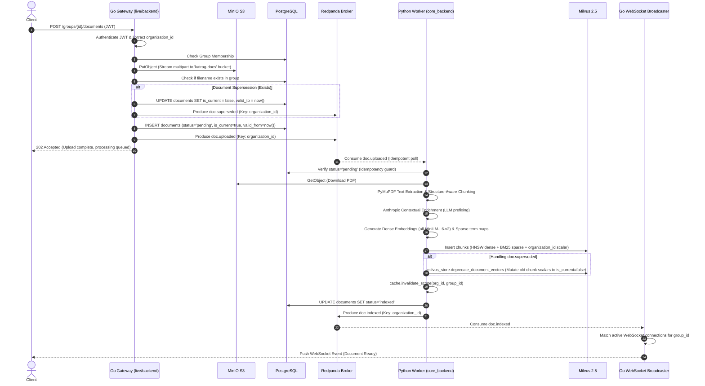
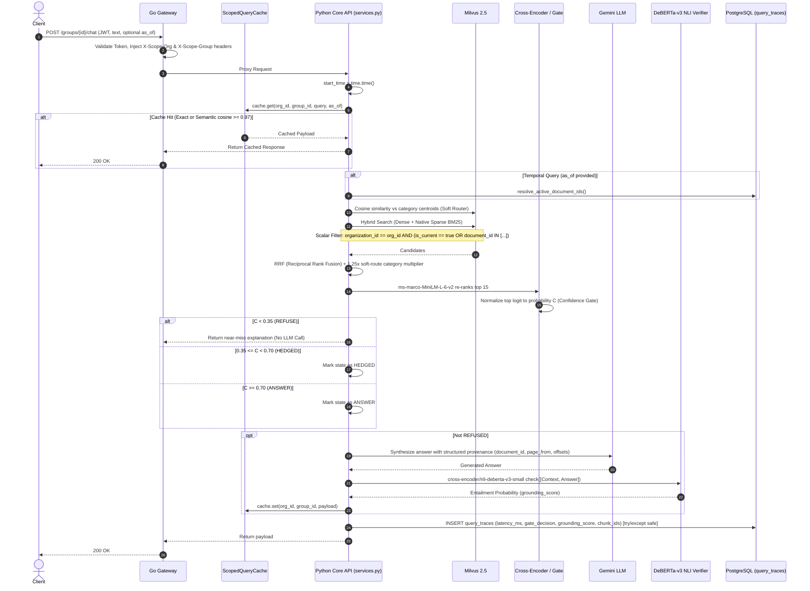
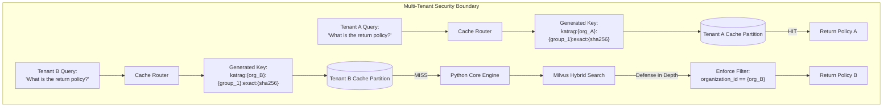

# KatRAG v1 — Authoritative Flow Diagrams (Source of Truth)

> **Policy:** This document supersedes all previous flow descriptions.
> Update here first, then update code.
> Every label maps 1-to-1 to a real function, route, or table in the codebase.

---

## Section 1: System Index & Error Matrix

### Error Reference

| Error | Code | Service | Description |
|---|---|---|---|
| Successful Operation | 200 | Go Gateway / Python Core | Query executed or operation succeeded |
| Ingestion Queued | 202 | Go Gateway | Document uploaded, saved to MinIO, and `doc.uploaded` published to Kafka |
| Bad Request | 400 | Go Gateway | Invalid input payload or missing fields |
| Unauthorized / Bad JWT | 401 | Go Gateway | Expired/malformed JWT, signature mismatch, missing token |
| Forbidden | 403 | Go Gateway | User is not a member of the requested group |
| Not Found | 404 | Go Gateway / Python Core | Group or document does not exist |
| Rate Limited (Fallback) | 429 | Python Core | LLM API rate limit exceeded (handled gracefully via fallback if configured) |
| Service Unavailable | 503 | Go Gateway | Python Core Engine is unreachable or crashed |

---

## Section 2: Diagram 1 — Asynchronous Ingestion & Document Versioning

**WHY this exists:** Synchronous FastAPI background tasks drop data on pod restarts. This event-driven ingestion loop decouples file upload from heavy ML processing. Go handles the network and storage boundary (MinIO), and Redpanda guarantees delivery to the headless Python worker.

---

## Section 3: Diagram 2 — Retrieval, Scoped Caching & Grounded Generation

**WHY this exists:** A multi-stage retrieval funnel that mathematically guarantees isolation across tenants while protecting the generative LLM from hallucination via Cross-Encoder gating and NLI entailment scoring.

---

## Section 4: Diagram 3 — Multi-Tenant Security & Cache Isolation Boundary

**WHY this exists:** A semantic cache that keys solely on query text is a P0 vulnerability in a multi-tenant system. KatRAG strictly prefixes keys, ensuring Tenant A and Tenant B never cross-pollinate.

