# KatRAG v1 — Authoritative Flow Diagrams (Source of Truth)

> **Policy:** This document supersedes all previous flow descriptions.
> Update here first, then update code.
> Every label maps **1-to-1** to a real function, endpoint, database column, or Kafka event in the codebase.
> No aspirational architecture. No hand-waving.

---

## Master Index: All Covered Scenarios

### Diagram 1 — Asynchronous Ingestion & Document Versioning

| Flow | Trigger | What It Covers |
|---|---|---|
| **F1 – Upload Initiation** | `POST /groups/{id}/documents` | JWT validation → group membership check → MinIO PutObject stream → versioning check (supersession or fresh insert) → Postgres row insert → produce `doc.uploaded` → 202 Accepted |
| **F2 – Worker: doc.uploaded** | Kafka `doc.uploaded` | Idempotency guard → MinIO download → `extract_blocks_from_pdf` → `chunk_structural_blocks` → `enrich_chunks_with_context` → auto-categorization (vector ≥ 0.60 → LLM → 'general') → Parent-Child embedding → Milvus upsert → produce `doc.indexed` |
| **F3 – Worker: doc.superseded** | Kafka `doc.superseded` | `milvus_store.deprecate_document_vectors()` → is_current=false mutation, no delete |
| **F4 – Post-Ingestion Taxonomy** | Within `process_document_task` | `update_categorical_summary()` (LLM / bypass / 429 fallback) → `consolidate_categories()` (Gemini taxonomy architect) |
| **F5 – WebSocket Broadcast** | Kafka `doc.indexed` / `doc.failed` | Go WS Broadcaster matches group_id → push to browser |

### Diagram 2 — Retrieval, Scoped Caching & Grounded Generation

| Flow | Trigger | What It Covers |
|---|---|---|
| **F6 – Cache Hit** | `POST /groups/{id}/chat` | `cache.get()` SHA-256 exact OR semantic cosine >= 0.97 → return payload, bypass all ML |
| **F7 – Temporal Retrieval** | `as_of` timestamp provided | `resolve_active_document_ids()` → temporal `valid_from <= as_of AND (valid_to IS NULL OR valid_to > as_of)` |
| **F8 – Mode A** | `document_id` provided | Single-doc scope → Milvus hybrid dense + sparse |
| **F9 – Mode B** | `category` provided | Category doc list from Postgres → scoped Milvus search |
| **F10 – Mode C** | No override | Soft Router top-3 (score >= 0.4) → 1.25x boost → merge with global hits → RRF |
| **F11 – Confidence Gate** | After Cross-Encoder | sigmoid(logit) → REFUSE < 0.35 → HEDGED < 0.70 → ANSWER |
| **F12 – NLI Grounding** | Post-LLM synthesis | DeBERTa-v3-small entailment check → grounding_score |
| **F13 – Passive Telemetry** | Every query | QueryTrace INSERT (latency_ms, gate_decision, grounding_score, chunk_ids) in try/except |

### Diagram 3 — Multi-Tenant Security & Cache Isolation

| Flow | Trigger | What It Covers |
|---|---|---|
| **F14 – Cache Key Isolation** | Any cache operation | Key prefix `katrag:{org_id}:{group_id}:exact:{sha256}` — same query from different orgs = different keys |
| **F15 – Milvus Defense-in-Depth** | Every search | C++ scalar filter `organization_id == org_id AND is_current == true` |

---

## System Error Reference Matrix

| Scenario | Code | Service | Raised By |
|---|---|---|---|
| Invalid or expired JWT | 401 | Go Gateway | `validateToken()` middleware |
| Not a group member | 403 | Go Gateway | `assertMembership()` |
| Group not found | 404 | Go Gateway | Group lookup |
| Document not ready | 404 / REFUSE | Go / Python Core | Doc status guard |
| Non-PDF or invalid file | 400 | Go Gateway | Content-type validation |
| PDF unreadable / scanned | `status='failed'` | Python Worker | `extract_blocks_from_pdf()` returns empty |
| Worker pipeline exception | `doc.failed` event | Python Worker | Outer catch in `run_worker` |
| Kafka _PARTITION_EOF | silent continue | Python Worker | `consumer.poll()` guard |
| No ready documents | 200 REFUSE | Python Core | `ready_count == 0` in `answer_question` |
| Zero Milvus hits | 200 REFUSE | Python Core | `if not hits:` guard |
| Cross-Encoder C < 0.35 | 200 REFUSE | Python Core | `gate_decision == "REFUSE"` |
| Gemini 429 in summary | Heuristic fallback | Python Core | `update_categorical_summary` 429 catch |
| Gemini 429 in consolidation | No-op | Python Core | `consolidate_categories` exception |
| Gemini 429 in synthesis | Raw Milvus preview | Python Core | `generate_answer` with bypass_llm |
| Telemetry write fails | silent | Python Core | `QueryTrace` INSERT try/except |
| Python Core unreachable | 503 | Go Gateway | HTTP proxy error |

---

## Diagram 1 — Asynchronous Ingestion & Document Versioning

**WHY this exists:**
In-process FastAPI BackgroundTask workers are killed on pod restart, dropping data silently. The event-driven Go→Redpanda→Python pipeline guarantees durability. Go owns the network boundary. Python owns heavy ML compute. They share nothing except Postgres rows and Kafka events.

```mermaid
sequenceDiagram
    autonumber
    actor Client
    participant GW   as Go API Gateway (live/backend)
    participant S3   as MinIO S3 (bucket: katrag-docs)
    participant PG   as PostgreSQL
    participant RP   as Redpanda Broker
    participant WRK  as Python Worker (worker.py::run_worker)
    participant SVC  as services.process_document_task
    participant MV   as Milvus 2.5
    participant WS   as Go WebSocket Broadcaster

    Note over Client,WS: ── F1: Upload Initiation & Versioning (POST /groups/{id}/documents) ──

    Client->>GW: POST /groups/{id}/documents (multipart/form-data, Authorization: Bearer JWT)
    GW->>GW: jwt.Parse(token) → extract user_id, organization_id
    alt JWT invalid or expired
        GW-->>Client: 401 Unauthorized
    end
    GW->>PG: SELECT GroupMember WHERE group_id=id AND user_id=user_id
    alt User not a member of this group
        GW-->>Client: 403 Forbidden
    end
    GW->>S3: PutObject(bucket='katrag-docs', key=object_name, reader=multipart_stream)
    Note over GW,S3: File streams byte-by-byte. Gateway never buffers full PDF in RAM.
    GW->>PG: SELECT Document WHERE filename=filename AND group_id=id
    alt Document already exists — Supersession path
        GW->>PG: UPDATE DocumentVersion SET is_current=false, valid_to=now() WHERE document_id=existing.id AND is_current=true
        GW->>PG: INSERT DocumentVersion (document_id=existing.id, version_num=prev+1, is_current=true, valid_from=now(), object_key)
        GW->>RP: Produce doc.superseded (Key: organization_id, Payload: {document_id, organization_id, object_name})
    else New document — Fresh insert path
        GW->>PG: INSERT Document (filename, status='pending', organization_id, group_id, file_size)
        GW->>PG: INSERT DocumentVersion (document_id, version_num=1, is_current=true, valid_from=now(), object_key)
    end
    GW->>RP: Produce doc.uploaded (Key: organization_id, Payload: {document_id, organization_id, object_name, group_id})
    GW-->>Client: 202 Accepted {message: "Document queued for processing"}
    Note over Client: Client opens WebSocket and waits for doc.indexed or doc.failed push

    Note over RP,WS: ── F2: Python Worker Consuming doc.uploaded ──

    RP-->>WRK: consumer.poll(timeout=1.0) → msg on topic 'doc.uploaded'
    alt msg.error() == KafkaError._PARTITION_EOF
        WRK->>WRK: continue (normal partition boundary, silent)
    else msg.error() is other KafkaError
        WRK->>WRK: raise KafkaException(msg.error())
    end
    WRK->>WRK: payload = json.loads(msg.value()) → document_id, organization_id, object_name
    alt Missing document_id or object_name in payload
        WRK->>WRK: logger.error("Missing fields") → continue
    end
    WRK->>PG: SELECT Document WHERE id=document_id
    alt Document not found in DB
        WRK->>WRK: logger.error("Document not found") → continue
    end
    alt doc.status in ["indexed", "processing", "failed"]
        WRK->>WRK: logger.warning("Already in state — skipping") → continue
        Note over WRK: Idempotency guard — prevents double-processing on Kafka replay after pod restart
    end
    WRK->>PG: UPDATE Document SET status='processing'
    WRK->>S3: minio_client.fget_object(bucket, object_name, /tmp/katrag_processing/{doc_id}.pdf)
    WRK->>PG: UPDATE Document SET file_path='/tmp/katrag_processing/{doc_id}.pdf'
    WRK->>SVC: asyncio.run(services.process_document_task(doc.id, doc.filename, bypass_llm=False))

    Note over SVC,MV: ── Inside process_document_task() ──

    SVC->>SVC: extract_blocks_from_pdf(file_path) [PyMuPDF structural block extraction]
    alt PDF empty, corrupt, or scanned — no extractable text
        SVC->>PG: UPDATE Document SET status='failed'
        SVC-->>WRK: returns (triggers doc.failed publish)
    end
    SVC->>SVC: chunk_structural_blocks(blocks, bypass_llm)
    Note over SVC: RecursiveCharacterTextSplitter with CHUNK_SIZE, CHUNK_OVERLAP, separators=[newline+newline, newline, period+space, space, empty]
    alt No chunks produced
        SVC->>PG: UPDATE Document SET status='failed'
        SVC-->>WRK: returns
    end
    SVC->>SVC: full_text_approx = join all block["text"] fields
    SVC->>SVC: enrich_chunks_with_context(full_text_approx, chunks, bypass_llm)
    Note over SVC: Anthropic Contextual Retrieval — LLM generates 1-2 sentence situating prefix per chunk. Stored as chunk["context_prefix"] and DocumentChunk.context_prefix.

    Note over SVC,MV: ── Dynamic Auto-Categorization ──
    SVC->>SVC: _extract_summary_text_from_pdf(file_path) [first 5 pages + last 2 pages via PdfReader]
    SVC->>SVC: first_chunk_vector = _embed_query(summary_text[:1000])
    SVC->>MV: milvus_store.search_categories(first_chunk_vector, top_k=1, group_id=doc.group_id)
    alt matches[0]["score"] >= 0.60 — Fast vector match path
        MV-->>SVC: resolved_category_name = matches[0]["category_name"]
    else score < 0.60 AND bypass_llm=false — LLM classification path
        SVC->>PG: SELECT Category WHERE group_id=doc.group_id [existing_categories excluding 'general']
        SVC->>SVC: llm_service.classify_ingested_document(text_sample[:4000], existing_categories)
        alt Gemini 429 or exception during classification
            SVC->>SVC: resolved_category_name = "general"
        end
    else bypass_llm=true OR score < 0.60 — Default fallback
        SVC->>SVC: resolved_category_name = "general"
    end
    SVC->>PG: GET Category WHERE name=resolved_category_name AND group_id=doc.group_id
    alt Category does not exist
        SVC->>PG: INSERT Category (name, group_id)
    end
    alt Doc was in 'general' but resolved to specific category
        SVC->>PG: doc.categories.remove(general_cat)
    end
    SVC->>PG: doc.categories.append(db_category) + db.commit()

    Note over SVC,MV: ── Parent-Child Embedding and Milvus Upsert ──
    SVC->>PG: DELETE DocumentChunk WHERE document_id=doc_id [clear prior chunks]
    loop For each parent chunk in structured_chunks
        SVC->>PG: INSERT DocumentChunk (document_id, chunk_index=parent_idx*1000, content, context_prefix, page_from, section_path)
        Note over SVC: db.flush() to get parent_db.id before inserting children
        loop For each child sub-chunk
            SVC->>SVC: embed_text = context_prefix + newline + child_text (or just child_text)
        end
    end
    SVC->>SVC: embeddings = _embed_texts(child_texts) [EMBEDDING_MODEL_INSTANCE.encode(), normalize_embeddings=True]
    SVC->>MV: milvus_store.upsert_chunks(document_id, child_texts, embeddings, organization_id)
    Note over MV: Inserts HNSW dense vectors + native sparse BM25 inverted index. Scalars: document_id, chunk_index, organization_id, is_current=true.
    MV-->>SVC: milvus_ids[] (one UUID per child chunk)
    loop For each child chunk
        SVC->>PG: INSERT DocumentChunk (document_id, chunk_index, content, context_prefix, milvus_id, parent_chunk_id=parent_db.id, page_from, section_path)
    end
    SVC->>PG: UPDATE Document SET status='ready'

    Note over SVC,MV: ── F4: Post-Ingestion Taxonomy Update ──
    loop For each category associated with this document
        SVC->>SVC: await update_categorical_summary(cat.name, doc.group_id, bypass_llm)
        alt bypass_llm=true
            SVC->>SVC: heuristic summary = "Category covers {cat_name}, files: {filenames}"
        else bypass_llm=false
            loop For each doc in category
                SVC->>SVC: _extract_summary_text_from_pdf(doc.file_path)
            end
            SVC->>SVC: Gemini prompt → 2-3 sentence unified category summary
            alt Gemini 429 during summary generation
                SVC->>SVC: heuristic fallback summary (same as bypass_llm path)
            end
        end
        SVC->>SVC: summary_vector = _embed_query(summary_text)
        SVC->>PG: UPDATE Category SET summary=summary_text WHERE name=cat_name AND group_id=group_id
        SVC->>MV: milvus_store.upsert_category_summary(category_name, summary_text, summary_vector, group_id)
    end
    SVC->>SVC: await consolidate_categories(doc.group_id, bypass_llm)
    alt bypass_llm=true OR fewer than 2 categories exist
        SVC->>SVC: return (consolidation skipped)
    else 2+ categories AND bypass_llm=false
        SVC->>PG: SELECT Category WHERE group_id → flat list with summaries
        SVC->>SVC: Gemini TAXONOMY ARCHITECT prompt → JSON [{parent_category, sub_category_ids[]}]
        Note over SVC: Prompt instructs Gemini to detect hierarchies, synthesize parent names, support multiple inheritance, return raw JSON array only
        alt Gemini returns [] OR 429 OR JSON parse error
            SVC->>SVC: consolidation no-ops safely (empty return)
        end
        loop For each {parent_category, sub_category_ids} entry
            SVC->>PG: GET or INSERT parent Category (name=parent_name, group_id)
            loop For each sub_category → each document in sub_category
                SVC->>PG: doc.categories.append(parent_cat) if not already member
            end
            SVC->>PG: db.commit()
            SVC->>SVC: await update_categorical_summary(parent_name, group_id, bypass_llm)
        end
    end

    Note over WRK,RP: ── Worker: Publish Result & Cleanup ──
    WRK->>PG: db.refresh(doc)
    alt doc.status != "failed"
        WRK->>PG: UPDATE Document SET status='indexed'
        WRK->>WRK: cache.invalidate_scope(org_id, group_id)
        Note over WRK: Deletes all exact_store keys matching katrag:{org_id}:{group_id}:* AND clears semantic_store[scope]
        WRK->>RP: Produce doc.indexed (Key: org_id, Payload: {document_id, status: "indexed", group_id})
    else doc.status == "failed"
        WRK->>RP: Produce doc.failed (Key: org_id, Payload: {document_id, status: "failed", error, group_id})
    end
    WRK->>WRK: os.remove(/tmp/katrag_processing/{doc_id}.pdf) [temp file cleanup]

    Note over RP,MV: ── F3: Worker Handling doc.superseded (parallel event) ──
    RP-->>WRK: consumer.poll() → msg on topic 'doc.superseded'
    WRK->>WRK: payload = {document_id, organization_id}
    alt Missing document_id or organization_id
        WRK->>WRK: logger.error("Missing fields") → continue
    end
    WRK->>MV: milvus_store.deprecate_document_vectors(document_id, organization_id)
    Note over MV: Sets is_current=false on all Milvus vectors for this document_id. ZERO vectors deleted. Temporal memory fully preserved.

    Note over RP,WS: ── F5: Go WebSocket Broadcaster ──
    RP-->>WS: Go background consumer catches doc.indexed OR doc.failed
    WS->>WS: Look up active WebSocket connections for payload.group_id
    alt Active connections exist for this group_id
        WS-->>Client: Push {type: "doc_ready" | "doc_failed", document_id, group_id}
    else No active connections
        WS->>WS: Event dropped silently
    end
```

---

## Diagram 2 — Retrieval, Scoped Caching & Grounded Generation

**WHY this exists:**
RAG without a confidence gate hallucinates freely. RAG without scoped caching is expensive at scale. RAG without NLI grounding cannot audit its own failure modes. This 5-stage pipeline stacks all three defenses — every answer is earned by cross-encoder probability, not just cosine similarity.

```mermaid
sequenceDiagram
    autonumber
    actor Client
    participant GW   as Go Gateway
    participant PY   as services.answer_question
    participant CA   as ScopedQueryCache (cache.py)
    participant PG   as PostgreSQL
    participant MV   as Milvus 2.5
    participant CX   as CrossEncoder (ms-marco-MiniLM-L-6-v2)
    participant LLM  as Gemini LLM (llm_service.generate_answer)
    participant NLI  as DeBERTa-v3-small NLI (verify_grounding)
    participant TR   as PostgreSQL (query_traces table)

    Note over Client,TR: ── F6 / F7: RAG Query (POST /groups/{id}/chat) ──

    Client->>GW: POST /groups/{id}/chat {question, top_k?, document_id?, category?, as_of?} Bearer JWT
    GW->>GW: jwt.Parse(token) → user_id, organization_id
    alt JWT invalid or expired
        GW-->>Client: 401 Unauthorized
    end
    GW->>PG: SELECT GroupMember WHERE group_id=id AND user_id=user_id
    alt Not a member
        GW-->>Client: 403 Forbidden
    end
    GW->>PY: Proxy request, inject X-Scope-Org: org_id and X-Scope-Group: group_id headers

    PY->>PY: start_time = time.time() [pipeline latency timer starts]
    PY->>PY: query_vector = _embed_query(question) [all-MiniLM-L6-v2, normalize_embeddings=True]
    PY->>PG: COUNT Document WHERE status='ready'
    alt ready_count == 0
        PY->>PG: COUNT Document WHERE status IN ('uploaded','processing')
        alt Processing docs exist
            PY-->>GW: {answer: "Documents still processing...", gate_decision: "REFUSE"}
        else No docs at all
            PY-->>GW: {answer: "No documents available...", gate_decision: "REFUSE"}
        end
    end

    Note over PY,CA: ── Stage 0: Scoped Cache Lookup (F6) ──

    PY->>CA: cache.get(org_id, group_id, question, query_vector, as_of)
    Note over CA: STEP 1 — Exact key generated: katrag:{org_id}:{group_id}:exact:SHA256(question + str(as_of))
    alt Exact key found in exact_store dict
        CA-->>PY: Cached payload (zero ML calls, zero Milvus calls)
        PY-->>GW: Cached payload
        GW-->>Client: 200 OK [p95 < 15ms]
    end
    Note over CA: STEP 2 — Semantic scan: iterate semantic_store[scope] where item.as_of matches
    alt cosine_similarity(query_vector, stored_embedding) >= 0.97 within same org+group scope
        CA-->>PY: Semantically matched cached payload
        PY-->>GW: Cached payload
        GW-->>Client: 200 OK
    end

    Note over PY,PG: ── Temporal Point-in-Time Scoping (F7) — only if as_of provided ──
    alt as_of timestamp provided in request
        PY->>PG: resolve_active_document_ids(db_session, group_id, as_of)
        Note over PG: SQL: DocumentVersion JOIN Document WHERE Document.group_id=group_id AND valid_from <= as_of AND (valid_to IS NULL OR valid_to > as_of)
        PG-->>PY: temporal_doc_ids[] (document IDs that were active at that exact moment)
        Note over PY: These IDs unlock is_current=false vectors in Milvus for historical point-in-time retrieval
    end

    Note over PY,MV: ── Stage 1: Hybrid Retrieval Mode Selection ──

    alt F8: document_id provided (Mode A — Single Document Pin)
        PY->>PG: SELECT Document WHERE id=document_id AND status='ready'
        alt Document not found or not ready
            PY-->>GW: {answer: "Document not ready or does not exist", gate_decision: "REFUSE"}
        end
        PY->>MV: milvus_store.search(question, query_vector, top_k=max(15,top_k*3), document_id=doc_id, organization_id)
        Note over MV: Scalar filter: document_id==doc_id AND organization_id==org_id. Dense HNSW + Sparse BM25. C++ RRFRanker fuses both.

    else F9: category provided (Mode B — Manual Category Scope)
        PY->>PG: SELECT Document.id JOIN Document.categories WHERE Category.name=category AND Document.status='ready'
        alt No ready docs in that category
            PY->>MV: Returns empty hits → falls through to REFUSE gate
        end
        PY->>MV: milvus_store.search(question, query_vector, top_k=max(15,top_k*3), document_ids=doc_ids, organization_id)
        Note over MV: Scalar filter: document_id IN (doc_ids) AND organization_id==org_id. Dense + Sparse.

    else F10: No override — Soft Multi-Category Routing (Mode C, default path)
        PY->>MV: milvus_store.search_categories(query_vector, top_k=3)
        Note over MV: Searches category_summaries Milvus collection. Returns [{category_name, score}] by cosine similarity.

        alt Top score < 0.4 OR no categories exist — Global flat search fallback
            Note over PY: Router confidence too low — skipping category filter, global search
            PY->>MV: milvus_store.search(question, query_vector, top_k=max(15,top_k*3), organization_id)
            Note over MV: Scalar: organization_id==org_id AND (is_current==true OR document_id IN temporal_ids)

        else Top score >= 0.4 — Soft Routing Activated
            PY->>PY: top_cats = [m["category_name"] for m in matches]  [Top-3]
            PY->>PY: routed_categories = top_cats [saved for QueryTrace telemetry]
            PY->>PG: SELECT Document.id JOIN categories WHERE Category.name IN (top_cats) AND Document.status='ready'
            PY->>MV: routed_hits = milvus_store.search(question, query_vector, top_k=80, document_ids=routed_doc_ids, organization_id)
            PY->>MV: global_hits = milvus_store.search(question, query_vector, top_k=40, organization_id)
            Note over MV: Both: is_current==true OR document_id IN temporal_ids scalar filter applied
            PY->>PY: Build hit_map from global_hits first
            PY->>PY: For each routed_hit: hit["score"] = hit["score"] * 1.25
            Note over PY: 1.25x boost: if same key exists in hit_map, keep whichever score is higher
            PY->>PY: hits = sorted(hit_map.values(), by score desc)[:max(15, top_k*3)]
        end
    end

    alt hits is empty after all retrieval paths
        PY-->>GW: {answer: "Documents do not contain sufficient information", gate_decision: "REFUSE"}
    end

    Note over PY,CX: ── Stage 2: Cross-Encoder Reranking and Confidence Gate (F11) ──

    PY->>CX: CROSS_ENCODER_INSTANCE.predict([[question, hit["content"]] for hit in hits])
    Note over CX: Model: cross-encoder/ms-marco-MiniLM-L-6-v2. Batch scores all (query, chunk) pairs as pairwise logits.
    CX-->>PY: scores[] (one raw logit float per hit)

    PY->>PY: hit["cross_score"] = float(scores[idx]) for each hit
    PY->>PY: hit["prob_relevant"] = sigmoid(cross_score) where sigmoid(x) = 1 / (1 + exp(-x))
    PY->>PY: hits.sort(key=prob_relevant, reverse=True) → keep top_k

    PY->>PY: top_prob = hits[0]["prob_relevant"]

    alt top_prob < 0.35 — REFUSE gate
        PY->>PY: gate_decision = "REFUSE"
        PY-->>GW: {answer: "I could not find sufficiently relevant information...", citations: [], gate_decision: "REFUSE"}
        Note over PY: Gemini is NOT called. Zero token cost. Latency terminates here.
    else 0.35 <= top_prob < 0.70 — HEDGED gate
        PY->>PY: gate_decision = "HEDGED"
    else top_prob >= 0.70 — ANSWER gate
        PY->>PY: gate_decision = "ANSWER"
    end

    Note over PY,PG: ── Stage 3: Structured Citation Metadata Enrichment ──
    loop For each hit in top_k
        PY->>PG: SELECT DocumentChunk WHERE document_id=hit.document_id AND chunk_index=hit.chunk_index
        PG-->>PY: chunk_db.page_from, chunk_db.section_path, chunk_db.parent_chunk_id
        alt chunk has parent_chunk_id set — Parent-Child retrieval path
            PY->>PG: SELECT DocumentChunk WHERE id=parent_chunk_id
            PG-->>PY: parent.content [richer, more coherent parent passage replaces child as context]
        end
        PY->>PY: citations.append({document_id, chunk_id: "docid_chunkidx", page_from, section_path, score: cross_score, prob_relevant, content_preview: content[:220]})
    end
    PY->>PY: context = "[Source N] (Page P, Section: S): {hit.content}" joined for each hit

    Note over PY,LLM: ── Stage 4: LLM Answer Synthesis ──
    PY->>LLM: generate_answer(question, context, bypass_llm)
    alt bypass_llm=false — Normal path
        LLM-->>PY: Grounded answer string referencing context chunks
    else bypass_llm=true OR Gemini 429
        PY->>PY: answer = "Gemini quota hit — showing raw Milvus match previews"
    end
    alt gate_decision == "HEDGED"
        PY->>PY: answer = "Based on limited available documentation, " + answer
    end

    Note over PY,NLI: ── Stage 5: NLI Grounding Verification (F12) ──
    PY->>NLI: verify_grounding(answer, [hit["content"] for hit in hits])
    Note over NLI: Model: cross-encoder/nli-deberta-v3-small. Runs softmax([contradiction, neutral, entailment]) on (premise=chunk, hypothesis=answer) pairs. Returns entailment probability.
    NLI-->>PY: grounding_score (float 0.0-1.0)

    PY->>PY: payload = {answer, citations, gate_decision, grounding_score}

    alt gate_decision != "REFUSE"
        PY->>CA: cache.set(org_id, group_id, question, query_vector, payload, as_of)
        Note over CA: Writes to exact_store[katrag:{org_id}:{group_id}:exact:{sha256}] AND appends to semantic_store[scope] list
    end

    Note over PY,TR: ── F13: Passive Telemetry — Non-Blocking (try/except) ──
    PY->>PY: latency_ms = int((time.time() - start_time) * 1000)
    PY->>PY: retrieved_chunk_ids = [c["chunk_id"] for c in citations]
    PY->>TR: INSERT QueryTrace(organization_id, group_id, query_text, routed_categories, gate_decision, grounding_score, latency_ms, retrieved_chunk_ids, created_at=utcnow())
    alt DB write fails (connection error, schema mismatch)
        TR-->>PY: Exception caught silently — print(f"Telemetry logging failed: {e}")
        Note over PY: Telemetry NEVER crashes the user query. Observability is fully passive.
    end

    PY-->>GW: 200 {answer, citations[], gate_decision, grounding_score}
    GW-->>Client: 200 OK
```

---

## Diagram 3 — Multi-Tenant Security & Cache Isolation Boundary

**WHY this exists:**
The Loaded Gun Principle (§13.2): A semantic cache keyed solely on query text is a P0 data leak. If Org A and Org B ask the exact same question, a naive system hands Org A's HR policies to Org B's employees. KatRAG makes organization_id and group_id mathematically inseparable from every cache key, with the Milvus C++ scalar filter as the defense-in-depth backstop.

```mermaid
flowchart TD
    subgraph "Multi-Tenant Query Isolation"
        Q1["Tenant A\n'What is the return policy?'\norg_id=org_A, group_id=1"] --> KA[cache.generate_exact_key]
        Q2["Tenant B\n'What is the return policy?'\norg_id=org_B, group_id=1"] --> KB[cache.generate_exact_key]

        KA --> KEY_A["katrag:org_A:1:exact:SHA256('What is the return policy?None')"]
        KB --> KEY_B["katrag:org_B:1:exact:SHA256('What is the return policy?None')"]

        KEY_A --> STORE_A[(exact_store — org_A partition)]
        KEY_B --> STORE_B[(exact_store — org_B partition)]

        STORE_A -- "HIT — org_A data only" --> RET_A["Org A: Policy A payload"]
        STORE_B -- "MISS — keys are disjoint by construction" --> MISS_B["Cache Miss → Full ML Pipeline"]

        MISS_B --> EMB["_embed_query(question) → 384-dim vector"]
        EMB --> MIL["milvus_store.search(query_vector, organization_id='org_B')"]
        MIL --> FILTER["C++ Scalar Filter at retrieval layer:\norganization_id == 'org_B'\nAND is_current == true"]
        FILTER -- "org_A and org_C vectors physically excluded" --> CHUNKS["Only org_B chunks returned"]
        CHUNKS --> PIPE["CrossEncoder → Confidence Gate → Gemini → NLI"]
        PIPE --> RET_B["Org B: Policy B payload"]
        RET_B --> CACHE_SET["cache.set() writes to katrag:org_B:1:...\nNever touches org_A partition"]
    end

    subgraph "Cache Invalidation on Ingestion"
        EV["Kafka: doc.indexed or doc.superseded\n{organization_id, group_id}"] --> INV["worker.py:\ncache.invalidate_scope(org_id, group_id)"]
        INV --> DEL_E["Delete all exact_store keys where\nkey.startswith('katrag:{org_id}:{group_id}:')"]
        INV --> DEL_S["del semantic_store['katrag:{org_id}:{group_id}']"]
        DEL_E --> GUAR["Guarantee: stale cached answers\nare impossible after any\ningestion or supersession event"]
        DEL_S --> GUAR
    end
```

---

## Appendix A: Key Data Models

| SQLAlchemy Model | Table | Key Fields |
|---|---|---|
| `Organization` | `organizations` | `id (str)`, `plan_tier`, `status`, `settings (JSON)` |
| `Group` | `groups` | `id (int)`, `organization_id (FK)`, `name`, `created_by (FK User)` |
| `GroupMember` | `group_members` | `group_id (FK)`, `user_id (FK)`, `joined_at` |
| `User` | `users` | `id (int)`, `organization_id (FK)`, `email (unique)`, `hashed_password`, `role` |
| `Document` | `documents` | `id (int)`, `organization_id (FK)`, `group_id (FK)`, `filename`, `status`, `file_path`, `file_size` |
| `DocumentVersion` | `document_versions` | `id (str)`, `document_id (FK)`, `version_num`, `is_current (bool)`, `valid_from`, `valid_to`, `content_hash`, `object_key`, `authority_score`, `index_version` |
| `DocumentChunk` | `document_chunks` | `id (int)`, `document_id (FK)`, `chunk_index`, `content`, `context_prefix`, `milvus_id`, `parent_chunk_id (self-FK)`, `page_from`, `section_path`, `char_start`, `char_end` |
| `Category` | `categories` | `id (int)`, `name`, `group_id (FK)`, `summary` |
| `DocumentCategory` | `document_categories` | `document_id (FK)`, `category_id (FK)` |
| `QueryTrace` | `query_traces` | `id (UUID)`, `organization_id`, `group_id`, `query_text`, `routed_categories (JSON)`, `gate_decision`, `grounding_score (float)`, `latency_ms (int)`, `retrieved_chunk_ids (JSON)`, `created_at` |

---

## Appendix B: Key Configuration Constants

| Constant | Source File | Default | Purpose |
|---|---|---|---|
| `EMBEDDING_MODEL` | `config.py` | `sentence-transformers/all-MiniLM-L6-v2` | Dense embedding model (384-dim) |
| `CROSS_ENCODER_MODEL` | `config.py` | `cross-encoder/ms-marco-MiniLM-L-6-v2` | Pairwise reranking model |
| `CROSS_ENCODER_THRESHOLD` | `config.py` | `0.35` | Confidence gate hard cutoff — below = REFUSE |
| `CHUNK_SIZE` | `config.py` | _(configured)_ | Max chars per RecursiveCharacterTextSplitter chunk |
| `CHUNK_OVERLAP` | `config.py` | _(configured)_ | Overlap chars between consecutive chunks |
| `KAFKA_BROKER_URL` | `config.py` | `redpanda:9092` | Redpanda broker address |
| `MINIO_BUCKET_NAME` | `config.py` | `katrag-docs` | S3 bucket for raw PDF storage |
| `MINIO_ENDPOINT` | `config.py` | `minio:9000` | MinIO service address |
| `MILVUS_COLLECTION` | `config.py` | `document_chunks` | Primary Milvus collection |
| Kafka consumer group | `worker.py` | `katrag-ingestion-group` | Consumer group ID (used by KEDA for lag-based autoscaling) |
| Worker temp dir | `worker.py` | `/tmp/katrag_processing/` | Temp directory for PDF downloads during ingestion |
| Semantic cache cosine threshold | `cache.py` | `0.97` | Cosine floor for semantic cache hit (within same org+group scope) |
| Category routing activation score | `services.py` | `0.4` | Milvus category score floor for soft routing to activate |
| Category vector match (ingestion) | `services.py` | `0.60` | Fast-path floor — at or above, doc auto-categorizes without LLM |
| Routed hit score multiplier | `services.py` | `1.25x` | Boost applied to hits from soft-routed category documents |
| Soft router top-K categories | `services.py` | `3` | Number of top categories proposed per query |
| NLI grounding model | `services.py` | `cross-encoder/nli-deberta-v3-small` | NLI entailment verifier |
